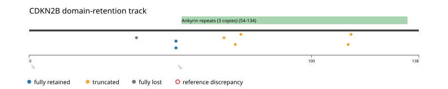
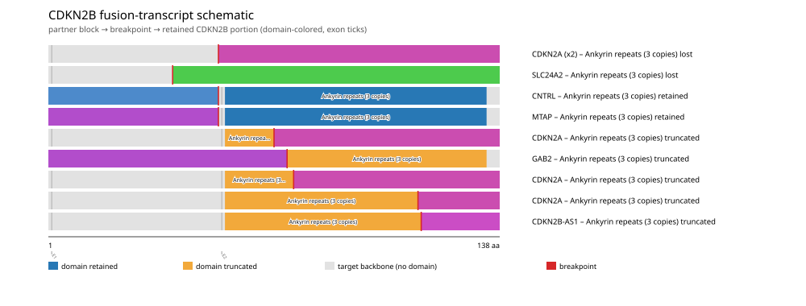
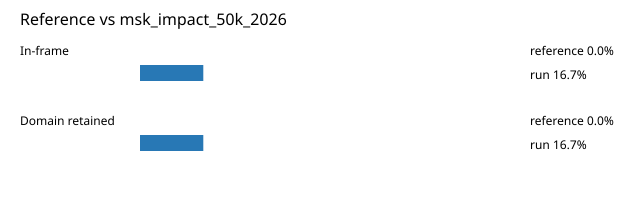

# CDKN2B real-data fusion benchmark: msk_impact_50k_2026

Retrieved from public cBioPortal and Genome Nexus on 2026-09-04.

## Results

- Structural variants returned for CDKN2B: 40
- Protein-fusion records found: 12
- Protein-fusion records mapped: 10
- Malformed/unmappable fusion records skipped: 2
- In-frame: 2/12 (16.7%)
- PF12796 (54-134 aa) retained: 2/12 (16.7%)
- In-frame and PF12796-retained: 2/2
- Fisher exact test (one-sided): odds ratio unavailable, p=0.0222222
- Breakpoint-permutation empirical p-value: 0.00990099
- Contingency table `[[retained/in-frame, retained/other], [not-retained/in-frame, not-retained/other]]`: `[[2, 0], [0, 8]]`

### Domain retention and discrepancies

*Domain-retention positions for analyzed fusion events; red outlines mark reference discrepancies.*

### Fusion-transcript schematic

*One row per recurrent partner/breakpoint group, sharing one amino-acid x-axis for CDKN2B's full protein length; the partner-contributed portion is colored per partner, the retained target-gene portion is colored by domain-retention status, and a red line marks the breakpoint.*

## Method

The cBioPortal `msk_impact_50k_2026_structural_variants` structural-variant profile was queried by the configured Entrez gene ID. Fusion-annotated records were adapted to the production SV schema and normalized; when `site2EffectOnFrame=NA`, frame status was resolved from `Event_Info`, not copied into `FusionEvent.Frame_status`.

CDKN2B genomic breakpoints were mapped against the Genome Nexus canonical transcript, and retention was classified against its returned PF12796 coordinates. Counts are event-level with no patient deduplication. The Fisher comparison's `other` column combines out-of-frame and unknown-frame events, as pre-specified by the domain-retention algorithm.

For each fusion, breakpoint selection preferred the Genome Nexus canonical transcript's exon-spanned target locus over cBioPortal site labels; malformed rows with no unambiguous target-locus coordinate were skipped and listed in Warnings.

## Full-suite highlights

- Registered algorithms executed: composite_score, confidence_stats, cutpoint_detection, domain_disruption, domain_retention, exon_retention, frequency, joint_partner
- Cutpoint detection: inferred breakpoint 52 aa; corrected permutation p=0.762376.
- Top composite score: CDKN2A (6 events), 0.430339.

## Partners

CDKN2A (6), CDKN2B-AS1 (1), CNTRL (1), ELAVL2 (1), GAB2 (1), MTAP (1), SLC24A2 (1)

## Warnings

- Skipped EVT-P-0031864-T01-IM6-4 (CDKN2A-CDKN2B): ValueError: CDKN2B fusion has no site breakpoint within target locus 22002902-22009362: Site1=21971407, Site2=22002380
- Skipped EVT-P-0020010-T01-IM6-35 (CDKN2B-ELAVL2): ValueError: could not determine 5'/3' role for CDKN2B in EVT-P-0020010-T01-IM6-35; Event_Info='Antisense Fusion'

## Reference comparison

*Configured reference percentages compared with this run.*

## Interpretation

These values describe the live study named above.
