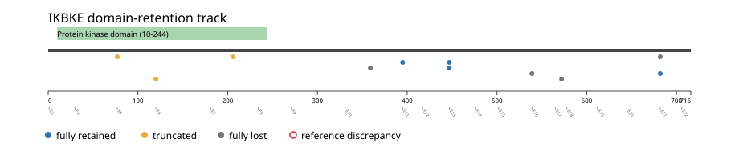
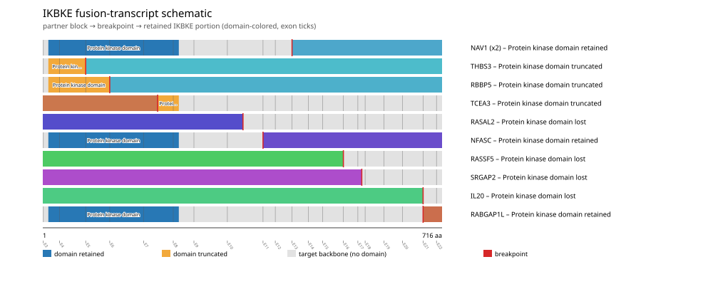
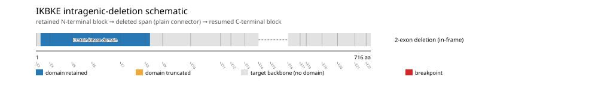
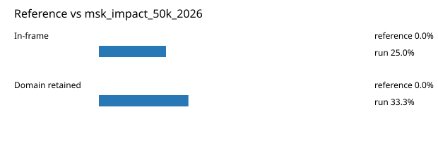

# IKBKE real-data fusion benchmark: msk_impact_50k_2026

Retrieved from public cBioPortal and Genome Nexus on 2026-09-04.

## Results

- Structural variants returned for IKBKE: 28
- Protein-fusion records found: 12
- Protein-fusion records mapped: 11
- Malformed/unmappable fusion records skipped: 1
- In-frame: 3/12 (25.0%)
- PF00069 (10-244 aa) retained: 4/12 (33.3%)
- In-frame and PF00069-retained: 3/3
- Fisher exact test (one-sided): odds ratio unavailable, p=0.0242424
- Breakpoint-permutation empirical p-value: 0.019802
- Contingency table `[[retained/in-frame, retained/other], [not-retained/in-frame, not-retained/other]]`: `[[3, 1], [0, 7]]`

### Domain retention and discrepancies

*Domain-retention positions for analyzed fusion events; red outlines mark reference discrepancies.*

### Fusion-transcript schematic

*One row per recurrent partner/breakpoint group, sharing one amino-acid x-axis for IKBKE's full protein length; the partner-contributed portion is colored per partner, the retained target-gene portion is colored by domain-retention status, and a red line marks the breakpoint.*

### Intragenic-deletion schematic

*Same-gene (Site1==Site2==IKBKE) intragenic-deletion-style SV records: a retained N-terminal block, a plain connector line for the deleted span, and a resumed C-terminal block.*

## Method

The cBioPortal `msk_impact_50k_2026_structural_variants` structural-variant profile was queried by the configured Entrez gene ID. Fusion-annotated records were adapted to the production SV schema and normalized; when `site2EffectOnFrame=NA`, frame status was resolved from `Event_Info`, not copied into `FusionEvent.Frame_status`.

IKBKE genomic breakpoints were mapped against the Genome Nexus canonical transcript, and retention was classified against its returned PF00069 coordinates. Counts are event-level with no patient deduplication. The Fisher comparison's `other` column combines out-of-frame and unknown-frame events, as pre-specified by the domain-retention algorithm.

For each fusion, breakpoint selection preferred the Genome Nexus canonical transcript's exon-spanned target locus over cBioPortal site labels; malformed rows with no unambiguous target-locus coordinate were skipped and listed in Warnings.

## Full-suite highlights

- Registered algorithms executed: composite_score, confidence_stats, cutpoint_detection, domain_disruption, domain_retention, exon_retention, frequency, joint_partner
- Cutpoint detection: inferred breakpoint 359 aa; corrected permutation p=0.39604.
- Top composite score: RASAL2 (1 events), 0.310832.

## Partners

IL20 (1), NAV1 (2), NFASC (1), RABGAP1L (1), RASAL2 (1), RASSF5 (1), RBBP5 (1), SMYD2 (1), SRGAP2 (1), TCEA3 (1), THBS3 (1)

## Warnings

- Skipped EVT-P-0032949-T01-IM6-20 (IKBKE-SMYD2): ValueError: could not determine 5'/3' role for IKBKE in EVT-P-0032949-T01-IM6-20; Event_Info='Antisense Fusion'

## Reference comparison

*Configured reference percentages compared with this run.*

## Interpretation

These values describe the live study named above.
