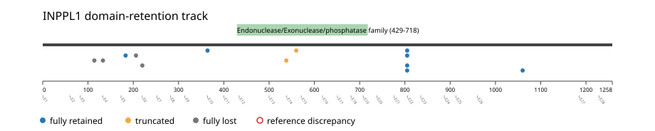
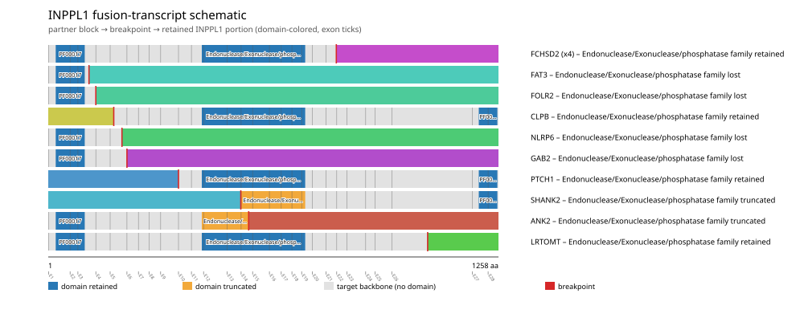
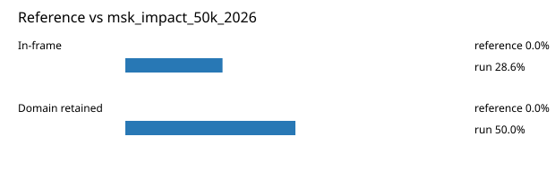

# INPPL1 real-data fusion benchmark: msk_impact_50k_2026

Retrieved from public cBioPortal and Genome Nexus on 2026-09-04.

## Results

- Structural variants returned for INPPL1: 39
- Protein-fusion records found: 14
- Protein-fusion records mapped: 13
- Malformed/unmappable fusion records skipped: 1
- In-frame: 4/14 (28.6%)
- PF03372 (429-718 aa) retained: 7/14 (50.0%)
- In-frame and PF03372-retained: 4/4
- Fisher exact test (one-sided): odds ratio unavailable, p=0.048951
- Breakpoint-permutation empirical p-value: 0.108911
- Contingency table `[[retained/in-frame, retained/other], [not-retained/in-frame, not-retained/other]]`: `[[4, 3], [0, 6]]`

### Domain retention and discrepancies

*Domain-retention positions for analyzed fusion events; red outlines mark reference discrepancies.*

### Fusion-transcript schematic

*One row per recurrent partner/breakpoint group, sharing one amino-acid x-axis for INPPL1's full protein length; the partner-contributed portion is colored per partner, the retained target-gene portion is colored by domain-retention status, and a red line marks the breakpoint.*

## Method

The cBioPortal `msk_impact_50k_2026_structural_variants` structural-variant profile was queried by the configured Entrez gene ID. Fusion-annotated records were adapted to the production SV schema and normalized; when `site2EffectOnFrame=NA`, frame status was resolved from `Event_Info`, not copied into `FusionEvent.Frame_status`.

INPPL1 genomic breakpoints were mapped against the Genome Nexus canonical transcript, and retention was classified against its returned PF03372 coordinates. Counts are event-level with no patient deduplication. The Fisher comparison's `other` column combines out-of-frame and unknown-frame events, as pre-specified by the domain-retention algorithm.

For each fusion, breakpoint selection preferred the Genome Nexus canonical transcript's exon-spanned target locus over cBioPortal site labels; malformed rows with no unambiguous target-locus coordinate were skipped and listed in Warnings.

## Full-suite highlights

- Registered algorithms executed: composite_score, confidence_stats, cutpoint_detection, domain_disruption, domain_retention, exon_retention, frequency, joint_partner
- Cutpoint detection: inferred breakpoint 560 aa; corrected permutation p=0.033966.
- Top composite score: ANK2 (1 events), 0.279288.

## Partners

ANK2 (1), CLPB (1), FAT3 (1), FCHSD2 (4), FOLR2 (1), GAB2 (1), LRTOMT (1), NLRP6 (1), PTCH1 (1), SHANK2 (1), SLC67A1 (1)

## Warnings

- Skipped EVT-P-0032233-T01-IM6-38 (SLC67A1-INPPL1): ValueError: could not determine 5'/3' role for INPPL1 in EVT-P-0032233-T01-IM6-38; Event_Info='Antisense Fusion'

## Reference comparison

*Configured reference percentages compared with this run.*

## Interpretation

These values describe the live study named above.
