# Genome-wide fusion-hotspot analysis of msk_impact_50k_2026

## Abstract

This manuscript synthesizes a genome-wide fusion-hotspot cohort scan of msk_impact_50k_2026: 3919 genes carried at least one structural-variant record in the cohort, of which 544 passed the >= 5-distinct-patient recurrence gate and were analyzed with the full registered algorithm suite (4 using hand-curated gene configs, 520 auto-configured, 20 gated in but unresolvable). 1 gene reached genome-wide Benjamini-Hochberg FDR significance (q < 0.05): ETV6 (90 events, 71.1% in-frame, 75.6% domain-retained, Fisher p=5.12326e-06, q=0.00433427). 15 additional genes form a highly ranked non-FDR-significant tier flagged for targeted follow-up (see Honorable mentions, below).

## Methods

Structural-variant records were retrieved from the msk_impact_50k_2026 cBioPortal study and gated to genes with at least 5 distinct patient(s) carrying a structural-variant record (544 of 3919 genes passed the gate: 4 using hand-curated gene configs and 520 auto-configured from Genome Nexus canonical-transcript/Pfam-domain data, with 20 gated-in gene(s) left unresolvable). Each gated gene was analyzed with the full registered algorithm suite (composite_score, confidence_stats, cutpoint_detection, domain_disruption, domain_retention, exon_retention, frequency, joint_partner). Domain-retention and domain-disruption significance were assessed per gene with Fisher's exact test and a breakpoint-position permutation test; the resulting p-values across all 544 scanned genes were jointly corrected with Benjamini-Hochberg false-discovery-rate correction at q < 0.05.

## Results

### Genome-wide summary

Genome-wide summary of 359 scanned genes with an FDR-adjusted q-value, ranked left-to-right by composite evidence score; the dashed line marks the q=0.05 significance threshold, with 1 gene above it.

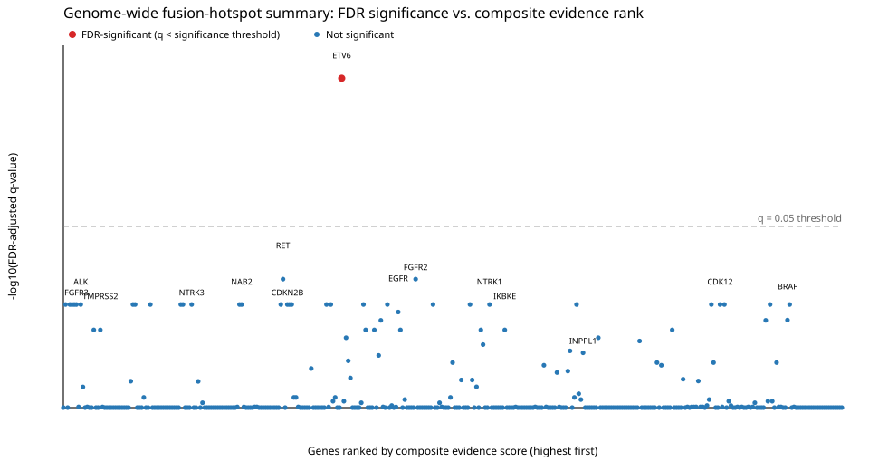

### FDR-significant and honorable-mention genes

| gene_symbol | tier | n_events_analyzed | in_frame_percent | domain_retention_percent | fisher_p_value | min_fdr_adjusted_q_value |
|---|---|---|---|---|---|---|
| ETV6 | FDR-significant | 90 | 71.11 | 75.56 | 5.123e-06 | 0.004334 |
| RET | Honorable mention | 194 | 75.26 | 92.27 | 0.0004197 | 0.1198 |
| FGFR2 | Honorable mention | 136 | 79.41 | 84.56 | 0.0004247 | 0.1198 |
| ALK | Honorable mention | 272 | 83.09 | 95.96 | 0.001917 | 0.1821 |
| EGFR | Honorable mention | 55 | 50.91 | 74.55 | 0.01145 | 0.2062 |
| BRAF | Honorable mention | 179 | 84.36 | 91.06 | 0.01337 | 0.2356 |
| FGFR3 | Honorable mention | 152 | 48.68 | 93.42 | 0.01948 | 0.1821 |
| CDKN2B | Honorable mention | 12 | 16.67 | 16.67 | 0.02222 | 0.1821 |
| IKBKE | Honorable mention | 12 | 25 | 33.33 | 0.02424 | 0.2771 |
| TMPRSS2 | Honorable mention | 867 | 29.99 | 6.113 | 0.0292 | 0.2771 |
| NTRK1 | Honorable mention | 78 | 41.03 | 82.05 | 0.04826 | 0.1821 |
| INPPL1 | Honorable mention | 14 | 28.57 | 50 | 0.04895 | 0.4047 |
| CDK12 | Honorable mention | 43 | 16.28 | 37.21 | 0.0677 | 0.1821 |
| NTRK3 | Honorable mention | 58 | 94.83 | 94.83 | 0.06955 | 0.1821 |
| NAB2 | Honorable mention | 72 | 34.72 | 68.06 | 0.1126 | 0.1821 |
| KDM5A | Honorable mention | 10 | 30 | 50 | 0.119 | 0.8758 |

### Gene highlights

#### ETV6 (FDR-significant)

ETV6 was analyzed across 90 fusion events, 71.1% in-frame and 75.6% domain-retained. Domain-retention Fisher's exact test p=5.12326e-06 (raw statistically significant at alpha=0.05). Genome-wide BH-adjusted q=0.00433427 (reaches genome-wide FDR significance).

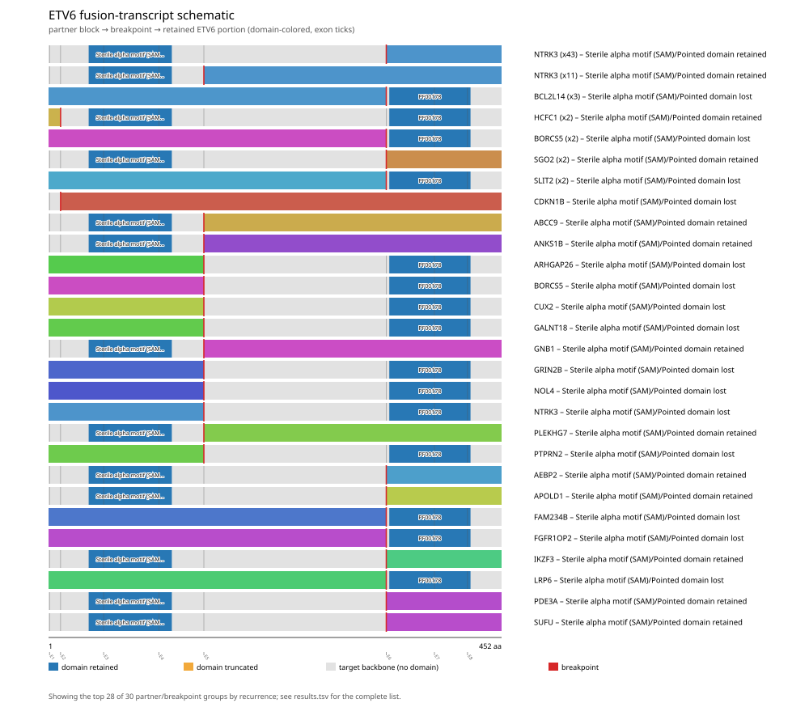

Full per-gene detail: [gene_reports/etv6/report.md](gene_reports/etv6/report.md)

#### RET (Honorable mention, Curated gene config)

RET was analyzed across 194 fusion events, 75.3% in-frame and 92.3% domain-retained. Domain-retention Fisher's exact test p=0.000419666 (raw statistically significant at alpha=0.05). Genome-wide BH-adjusted q=0.119762 (does not reach genome-wide FDR significance). Did not survive genome-wide multiple-testing correction (FDR-adjusted q-value at or above the significance threshold), but ranks highly by raw p-value among the non-FDR-significant genes and may warrant targeted follow-up. This is NOT a claim of statistical significance.

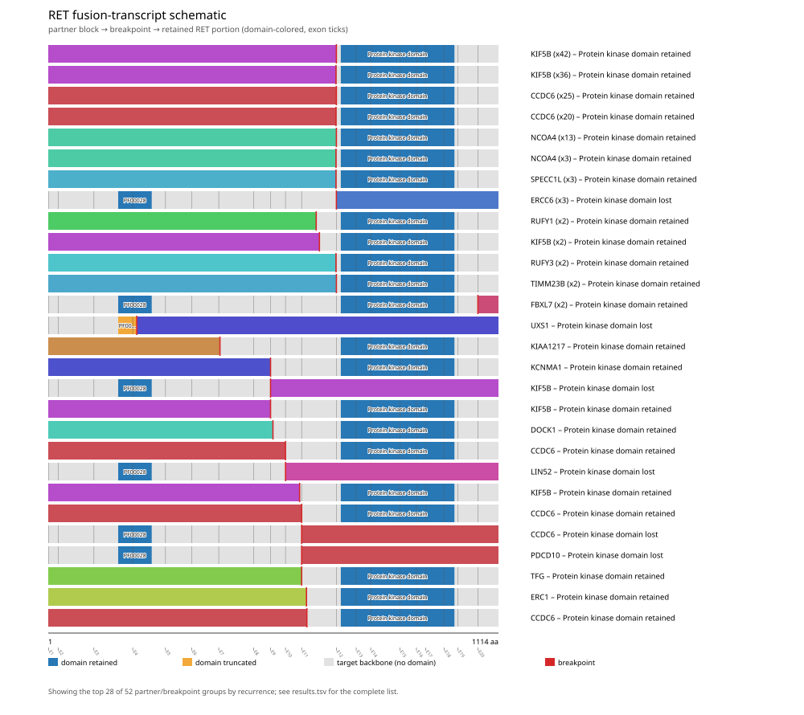

Full per-gene detail: [gene_reports/ret/report.md](gene_reports/ret/report.md)

#### FGFR2 (Honorable mention)

FGFR2 was analyzed across 136 fusion events, 79.4% in-frame and 84.6% domain-retained. Domain-retention Fisher's exact test p=0.000424687 (raw statistically significant at alpha=0.05). Genome-wide BH-adjusted q=0.119762 (does not reach genome-wide FDR significance). Did not survive genome-wide multiple-testing correction (FDR-adjusted q-value at or above the significance threshold), but ranks highly by raw p-value among the non-FDR-significant genes and may warrant targeted follow-up. This is NOT a claim of statistical significance.

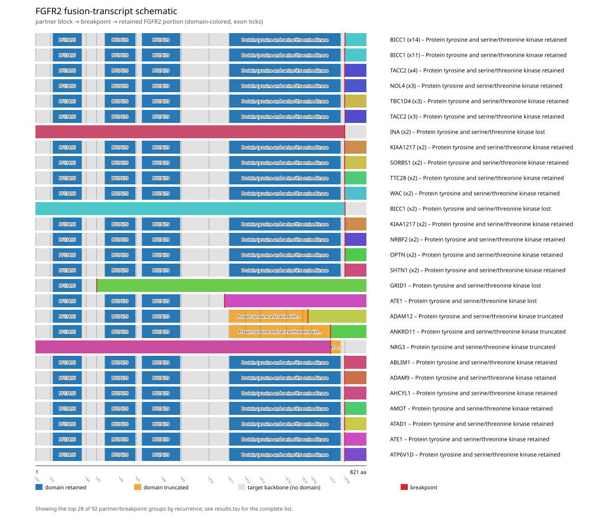

Full per-gene detail: [gene_reports/fgfr2/report.md](gene_reports/fgfr2/report.md)

#### ALK (Honorable mention, Curated gene config)

ALK was analyzed across 272 fusion events, 83.1% in-frame and 96.0% domain-retained. Domain-retention Fisher's exact test p=0.00191661 (raw statistically significant at alpha=0.05). Genome-wide BH-adjusted q=0.182092 (does not reach genome-wide FDR significance). Did not survive genome-wide multiple-testing correction (FDR-adjusted q-value at or above the significance threshold), but ranks highly by raw p-value among the non-FDR-significant genes and may warrant targeted follow-up. This is NOT a claim of statistical significance.

Full per-gene detail: [gene_reports/alk/report.md](gene_reports/alk/report.md)

#### EGFR (Honorable mention)

EGFR was analyzed across 55 fusion events, 50.9% in-frame and 74.5% domain-retained. Domain-retention Fisher's exact test p=0.0114539 (raw statistically significant at alpha=0.05). Genome-wide BH-adjusted q=0.206169 (does not reach genome-wide FDR significance). Did not survive genome-wide multiple-testing correction (FDR-adjusted q-value at or above the significance threshold), but ranks highly by raw p-value among the non-FDR-significant genes and may warrant targeted follow-up. This is NOT a claim of statistical significance.

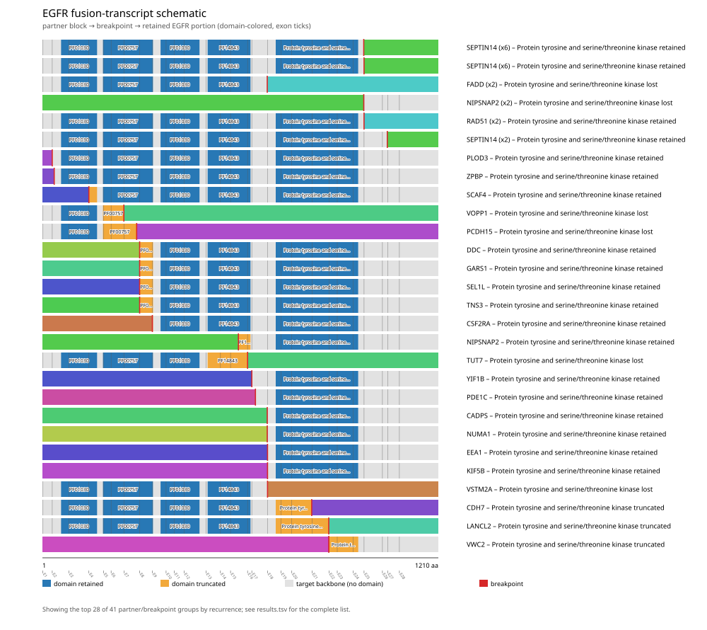

Full per-gene detail: [gene_reports/egfr/report.md](gene_reports/egfr/report.md)

#### BRAF (Honorable mention, Curated gene config)

BRAF was analyzed across 179 fusion events, 84.4% in-frame and 91.1% domain-retained. Domain-retention Fisher's exact test p=0.0133676 (raw statistically significant at alpha=0.05). Genome-wide BH-adjusted q=0.235603 (does not reach genome-wide FDR significance). Did not survive genome-wide multiple-testing correction (FDR-adjusted q-value at or above the significance threshold), but ranks highly by raw p-value among the non-FDR-significant genes and may warrant targeted follow-up. This is NOT a claim of statistical significance.

Full per-gene detail: [gene_reports/braf/report.md](gene_reports/braf/report.md)

#### FGFR3 (Honorable mention)

FGFR3 was analyzed across 152 fusion events, 48.7% in-frame and 93.4% domain-retained. Domain-retention Fisher's exact test p=0.0194824 (raw statistically significant at alpha=0.05). Genome-wide BH-adjusted q=0.182092 (does not reach genome-wide FDR significance). Did not survive genome-wide multiple-testing correction (FDR-adjusted q-value at or above the significance threshold), but ranks highly by raw p-value among the non-FDR-significant genes and may warrant targeted follow-up. This is NOT a claim of statistical significance.

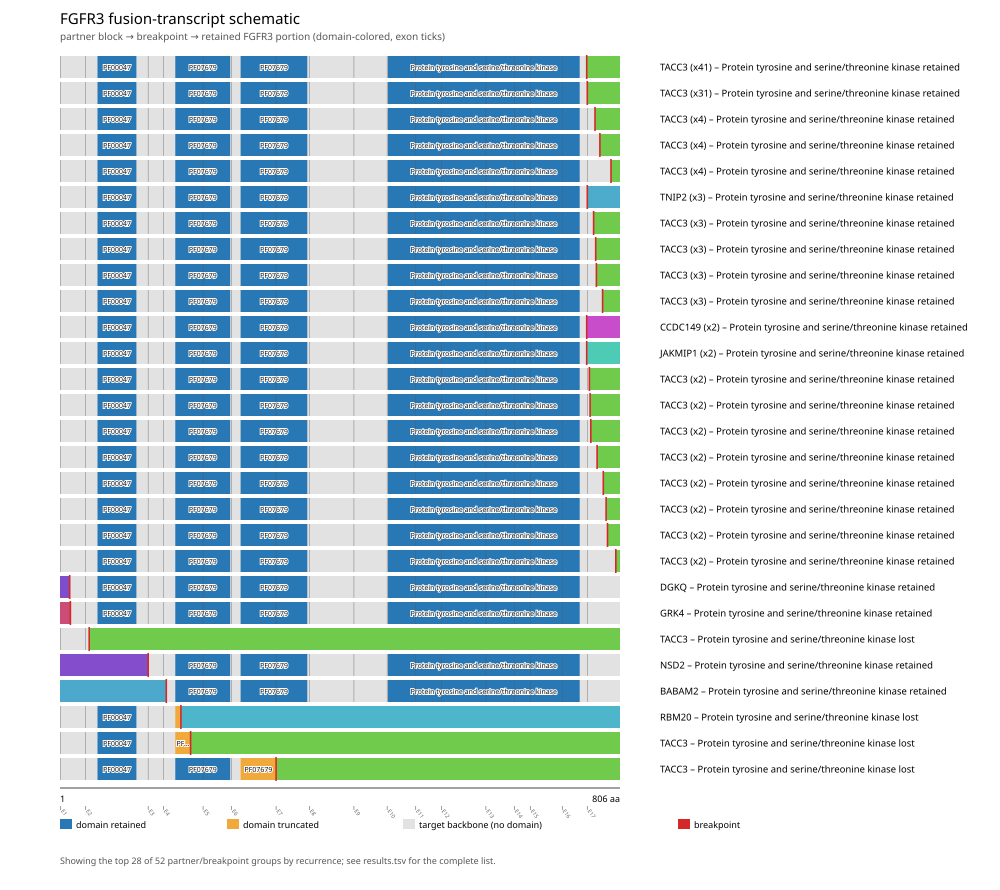

Full per-gene detail: [gene_reports/fgfr3/report.md](gene_reports/fgfr3/report.md)

#### CDKN2B (Honorable mention)

CDKN2B was analyzed across 12 fusion events, 16.7% in-frame and 16.7% domain-retained. Domain-retention Fisher's exact test p=0.0222222 (raw statistically significant at alpha=0.05). Genome-wide BH-adjusted q=0.182092 (does not reach genome-wide FDR significance). Did not survive genome-wide multiple-testing correction (FDR-adjusted q-value at or above the significance threshold), but ranks highly by raw p-value among the non-FDR-significant genes and may warrant targeted follow-up. This is NOT a claim of statistical significance.

Full per-gene detail: [gene_reports/cdkn2b/report.md](gene_reports/cdkn2b/report.md)

#### IKBKE (Honorable mention)

IKBKE was analyzed across 12 fusion events, 25.0% in-frame and 33.3% domain-retained. Domain-retention Fisher's exact test p=0.0242424 (raw statistically significant at alpha=0.05). Genome-wide BH-adjusted q=0.2771 (does not reach genome-wide FDR significance). Did not survive genome-wide multiple-testing correction (FDR-adjusted q-value at or above the significance threshold), but ranks highly by raw p-value among the non-FDR-significant genes and may warrant targeted follow-up. This is NOT a claim of statistical significance.

Full per-gene detail: [gene_reports/ikbke/report.md](gene_reports/ikbke/report.md)

#### TMPRSS2 (Honorable mention)

TMPRSS2 was analyzed across 867 fusion events, 30.0% in-frame and 6.1% domain-retained. Domain-retention Fisher's exact test p=0.0292045 (raw statistically significant at alpha=0.05). Genome-wide BH-adjusted q=0.2771 (does not reach genome-wide FDR significance). Did not survive genome-wide multiple-testing correction (FDR-adjusted q-value at or above the significance threshold), but ranks highly by raw p-value among the non-FDR-significant genes and may warrant targeted follow-up. This is NOT a claim of statistical significance.

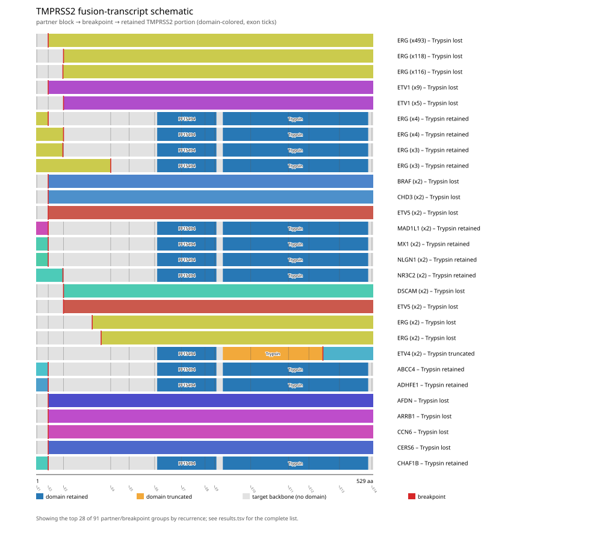

Full per-gene detail: [gene_reports/tmprss2/report.md](gene_reports/tmprss2/report.md)

#### NTRK1 (Honorable mention, Curated gene config)

NTRK1 was analyzed across 78 fusion events, 41.0% in-frame and 82.1% domain-retained. Domain-retention Fisher's exact test p=0.0482628 (raw statistically significant at alpha=0.05). Genome-wide BH-adjusted q=0.182092 (does not reach genome-wide FDR significance). Did not survive genome-wide multiple-testing correction (FDR-adjusted q-value at or above the significance threshold), but ranks highly by raw p-value among the non-FDR-significant genes and may warrant targeted follow-up. This is NOT a claim of statistical significance.

Full per-gene detail: [gene_reports/ntrk1/report.md](gene_reports/ntrk1/report.md)

#### INPPL1 (Honorable mention)

INPPL1 was analyzed across 14 fusion events, 28.6% in-frame and 50.0% domain-retained. Domain-retention Fisher's exact test p=0.048951 (raw statistically significant at alpha=0.05). Genome-wide BH-adjusted q=0.404722 (does not reach genome-wide FDR significance). Did not survive genome-wide multiple-testing correction (FDR-adjusted q-value at or above the significance threshold), but ranks highly by raw p-value among the non-FDR-significant genes and may warrant targeted follow-up. This is NOT a claim of statistical significance.

Full per-gene detail: [gene_reports/inppl1/report.md](gene_reports/inppl1/report.md)

#### CDK12 (Honorable mention)

CDK12 was analyzed across 43 fusion events, 16.3% in-frame and 37.2% domain-retained. Domain-retention Fisher's exact test p=0.0677006 (raw not statistically significant at alpha=0.05). Genome-wide BH-adjusted q=0.182092 (does not reach genome-wide FDR significance). Did not survive genome-wide multiple-testing correction (FDR-adjusted q-value at or above the significance threshold), but ranks highly by raw p-value among the non-FDR-significant genes and may warrant targeted follow-up. This is NOT a claim of statistical significance.

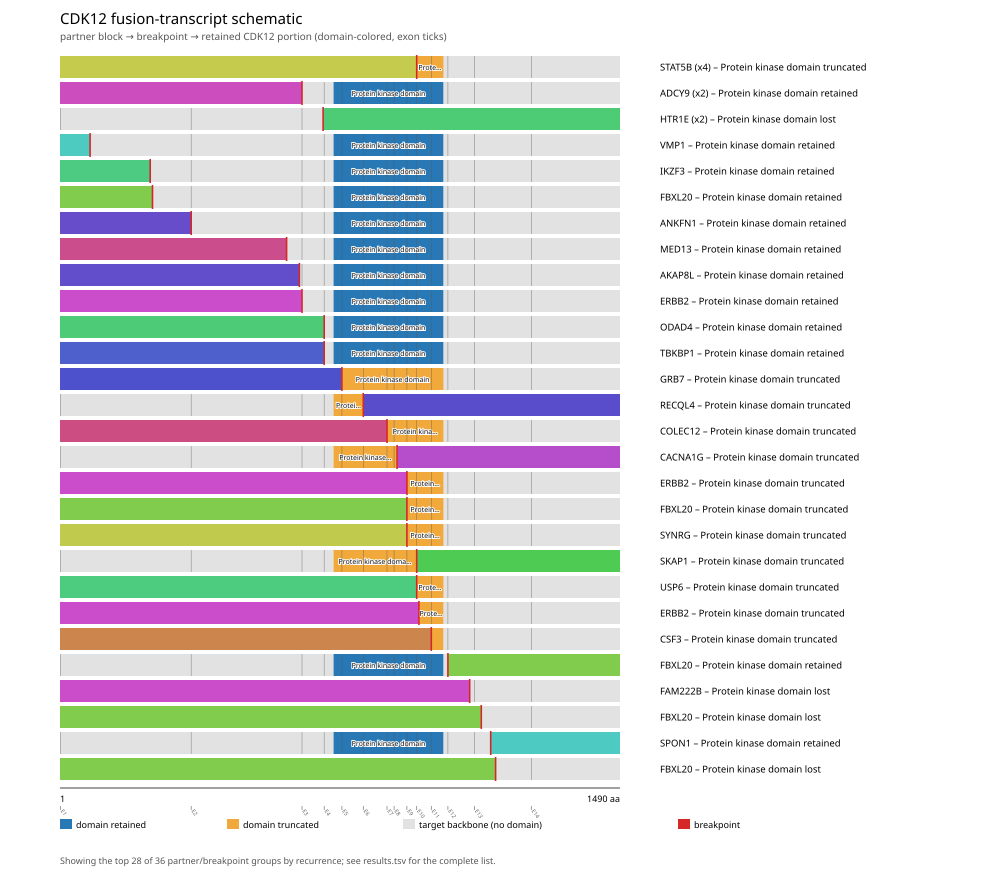

Full per-gene detail: [gene_reports/cdk12/report.md](gene_reports/cdk12/report.md)

#### NTRK3 (Honorable mention)

NTRK3 was analyzed across 58 fusion events, 94.8% in-frame and 94.8% domain-retained. Domain-retention Fisher's exact test p=0.0695489 (raw not statistically significant at alpha=0.05). Genome-wide BH-adjusted q=0.182092 (does not reach genome-wide FDR significance). Did not survive genome-wide multiple-testing correction (FDR-adjusted q-value at or above the significance threshold), but ranks highly by raw p-value among the non-FDR-significant genes and may warrant targeted follow-up. This is NOT a claim of statistical significance.

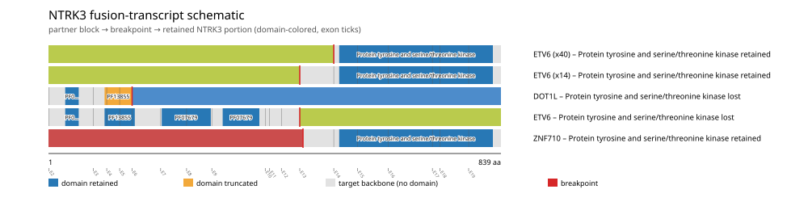

Full per-gene detail: [gene_reports/ntrk3/report.md](gene_reports/ntrk3/report.md)

#### NAB2 (Honorable mention)

NAB2 was analyzed across 72 fusion events, 34.7% in-frame and 68.1% domain-retained. Domain-retention Fisher's exact test p=0.11258 (raw not statistically significant at alpha=0.05). Genome-wide BH-adjusted q=0.182092 (does not reach genome-wide FDR significance). Did not survive genome-wide multiple-testing correction (FDR-adjusted q-value at or above the significance threshold), but ranks highly by raw p-value among the non-FDR-significant genes and may warrant targeted follow-up. This is NOT a claim of statistical significance.

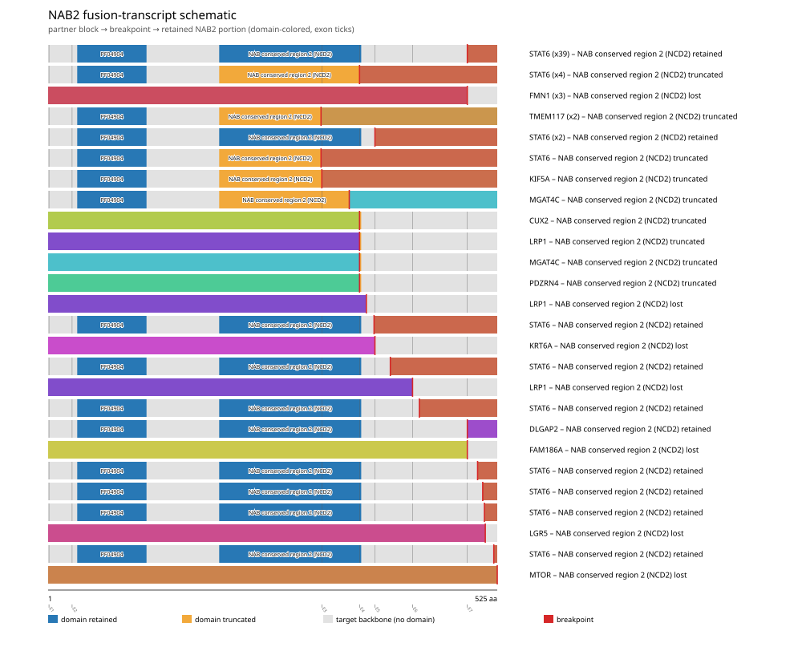

Full per-gene detail: [gene_reports/nab2/report.md](gene_reports/nab2/report.md)

#### KDM5A (Honorable mention)

KDM5A was analyzed across 10 fusion events, 30.0% in-frame and 50.0% domain-retained. Domain-retention Fisher's exact test p=0.119048 (raw not statistically significant at alpha=0.05). Genome-wide BH-adjusted q=0.875776 (does not reach genome-wide FDR significance). Did not survive genome-wide multiple-testing correction (FDR-adjusted q-value at or above the significance threshold), but ranks highly by raw p-value among the non-FDR-significant genes and may warrant targeted follow-up. This is NOT a claim of statistical significance.

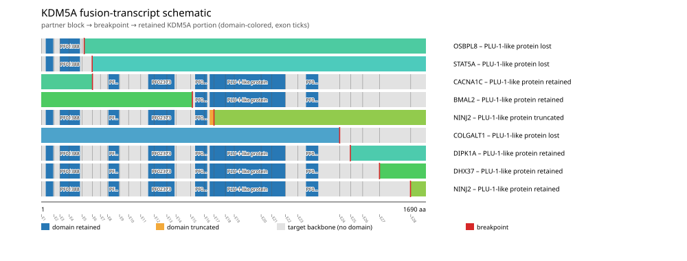

Full per-gene detail: [gene_reports/kdm5a/report.md](gene_reports/kdm5a/report.md)

## Discussion

- Cross-gene Benjamini-Hochberg FDR correction was applied jointly across all 544 scanned genes' p-values. This reduces false-positive findings relative to testing each gene in isolation, but is a conservative correction: a real per-gene effect can fail to reach the q < 0.05 threshold once corrected across the full scanned gene set.
- 4 gene(s) used hand-curated gene configurations, while 520 gene(s) were auto-configured from Genome Nexus canonical-transcript/Pfam-domain data using a kinase/catalytic-keyword heuristic to select the tracked domain; auto-configured domains have not been manually verified the way hand-curated ones have.
- Data were retrieved live from the public msk_impact_50k_2026 cBioPortal study as of 2026-09-04T15:54:53.136605+00:00. Some cBioPortal cohorts (e.g. actively accruing clinical-sequencing panels such as MSK-IMPACT) are updated periodically, so exact counts could shift if this scan is re-run later against such a cohort.
- All findings in this manuscript are computational, hypothesis-generating candidate evidence from bioinformatic analysis of public cohort data, not validated clinical calls; a gene's presence here is not a therapeutic or diagnostic recommendation.

## Appendix: per-gene report index

| gene_symbol | tier | config_source | n_events_analyzed | min_fdr_adjusted_q_value | report |
|---|---|---|---|---|---|
| ETV6 | FDR-significant | auto | 90 | 0.004334 | [gene_reports/etv6/report.md](gene_reports/etv6/report.md) |
| RET | Honorable mention; Curated gene config | curated | 194 | 0.1198 | [gene_reports/ret/report.md](gene_reports/ret/report.md) |
| FGFR2 | Honorable mention | auto | 136 | 0.1198 | [gene_reports/fgfr2/report.md](gene_reports/fgfr2/report.md) |
| ALK | Honorable mention; Curated gene config | curated | 272 | 0.1821 | [gene_reports/alk/report.md](gene_reports/alk/report.md) |
| EGFR | Honorable mention | auto | 55 | 0.2062 | [gene_reports/egfr/report.md](gene_reports/egfr/report.md) |
| BRAF | Honorable mention; Curated gene config | curated | 179 | 0.2356 | [gene_reports/braf/report.md](gene_reports/braf/report.md) |
| FGFR3 | Honorable mention | auto | 152 | 0.1821 | [gene_reports/fgfr3/report.md](gene_reports/fgfr3/report.md) |
| CDKN2B | Honorable mention | auto | 12 | 0.1821 | [gene_reports/cdkn2b/report.md](gene_reports/cdkn2b/report.md) |
| IKBKE | Honorable mention | auto | 12 | 0.2771 | [gene_reports/ikbke/report.md](gene_reports/ikbke/report.md) |
| TMPRSS2 | Honorable mention | auto | 867 | 0.2771 | [gene_reports/tmprss2/report.md](gene_reports/tmprss2/report.md) |
| NTRK1 | Honorable mention; Curated gene config | curated | 78 | 0.1821 | [gene_reports/ntrk1/report.md](gene_reports/ntrk1/report.md) |
| INPPL1 | Honorable mention | auto | 14 | 0.4047 | [gene_reports/inppl1/report.md](gene_reports/inppl1/report.md) |
| CDK12 | Honorable mention | auto | 43 | 0.1821 | [gene_reports/cdk12/report.md](gene_reports/cdk12/report.md) |
| NTRK3 | Honorable mention | auto | 58 | 0.1821 | [gene_reports/ntrk3/report.md](gene_reports/ntrk3/report.md) |
| NAB2 | Honorable mention | auto | 72 | 0.1821 | [gene_reports/nab2/report.md](gene_reports/nab2/report.md) |
| KDM5A | Honorable mention | auto | 10 | 0.8758 | [gene_reports/kdm5a/report.md](gene_reports/kdm5a/report.md) |
