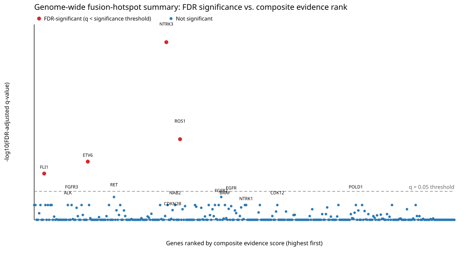

# Genome-wide fusion-hotspot cohort scan: msk_impact_50k_2026

- Total genes with any structural-variant record in the cohort: 3919
- Genes passing the >= 5-distinct-patient recurrence gate: 544
- Curated gene configs used: 4
- Auto-generated gene configs used: 520
- Genes gated in but unresolvable (no Genome Nexus canonical transcript): 20
- FDR-significant genes (q < 0.05) after Benjamini-Hochberg correction across all 544 scanned genes: 4

## Warnings

- 20 gated gene(s) had no resolvable canonical transcript in Genome Nexus and were skipped: AGAP3, CDH3, CDKN2B-AS1, CREB3L1, ERF, H3C2, H3C6, KMT2B, LINC00114, MAP3K14, MEF2B, NBPF20, PLCD3, RAB11FIP4, RECQL4, SEPTIN14, TCF3, TRAF2, TRAP1, ZFTA

## Honorable mentions: highly ranked non-FDR-significant genes worth human review

The following 15 gene(s) **did not survive genome-wide multiple-testing correction** (FDR-adjusted q-value at or above the q=0.05 significance threshold), but rank highest by raw Fisher p-value among the non-FDR-significant genes and may warrant targeted follow-up. This section is **not** a claim of statistical significance -- see the FDR-significant genes above for that.

| rank | gene_symbol | fisher_p_value | min_fdr_adjusted_q_value | n_events_analyzed | in_frame_percent | domain_retention_percent |
|---|---|---|---|---|---|---|
| 1 | RET | 0.0004197 | 0.09074 | 194 | 75.26 | 92.27 |
| 2 | FGFR2 | 0.0004247 | 0.09074 | 136 | 79.41 | 84.56 |
| 3 | ALK | 0.001917 | 0.2116 | 272 | 83.09 | 95.96 |
| 4 | EGFR | 0.01145 | 0.2368 | 55 | 50.91 | 74.55 |
| 5 | BRAF | 0.01337 | 0.2116 | 179 | 84.36 | 91.06 |
| 6 | FGFR3 | 0.01948 | 0.2116 | 152 | 48.68 | 93.42 |
| 7 | CDKN2B | 0.02222 | 0.3606 | 12 | 16.67 | 16.67 |
| 8 | NTRK1 | 0.04826 | 0.2116 | 78 | 41.03 | 82.05 |
| 9 | INPPL1 | 0.04895 | 0.4733 | 14 | 28.57 | 50 |
| 10 | CDK12 | 0.0677 | 0.2116 | 43 | 16.28 | 37.21 |
| 11 | NAB2 | 0.1126 | 0.2116 | 72 | 34.72 | 68.06 |
| 12 | KDM5A | 0.119 | 0.8816 | 10 | 30 | 50 |
| 13 | FH | 0.1333 | 0.673 | 16 | 6.25 | 12.5 |
| 14 | FGFR1 | 0.1807 | 0.5489 | 23 | 30.43 | 47.83 |
| 15 | POLD1 | 0.1923 | 0.2116 | 16 | 12.5 | 37.5 |

## Genome-wide summary plot

One point per scanned gene with an FDR-adjusted q-value: x-axis is genes ranked by composite evidence score (descending), y-axis is -log10(FDR-adjusted q-value), with a dashed line at the q=0.05 significance threshold.

## Scanned genes (sorted by significance)

| gene_symbol | config_source | status | distinct_patient_count | total_sv_count | n_events_analyzed | in_frame_percent | domain_retention_percent | fisher_p_value | permutation_p_value | min_fdr_adjusted_q_value | fdr_significant | top_composite_score | top_composite_partner_gene | error |
|---|---|---|---|---|---|---|---|---|---|---|---|---|---|---|
| NTRK3 | auto | ok | 71 | 71 | 58 | 94.83 | 94.83 | 0.06955 | 0.009901 | 7.663e-09 | yes | 0.3943 | ETV6 |  |
| ROS1 | auto | ok | 204 | 207 | 122 | 59.02 | 87.7 | 0.214 | 0.009901 | 0.0002077 | yes | 0.3874 | CD74 |  |
| ETV6 | auto | ok | 213 | 214 | 90 | 71.11 | 75.56 | 5.123e-06 | 0.009901 | 0.002189 | yes | 0.4489 | NTRK3 |  |
| FLI1 | auto | ok | 121 | 121 | 118 | 61.86 | 5.932 | 0.9888 | 0.802 | 0.007702 | yes | 0.5808 | EWSR1 |  |
| RET | curated | ok | 219 | 230 | 194 | 75.26 | 92.27 | 0.0004197 | 0.009901 | 0.09074 | no | 0.4345 | KIF5B |  |
| FGFR2 | auto | ok | 188 | 195 | 136 | 79.41 | 84.56 | 0.0004247 | 0.009901 | 0.09074 | no | 0.3373 | BICC1 |  |
| ERG | auto | ok | 863 | 863 | 788 | 30.2 | 96.07 | 0.8462 | 0.009901 | 0.2116 | no | 0.4484 | TMPRSS2 |  |
| EWSR1 | auto | ok | 415 | 418 | 349 | 65.33 | 11.17 | 1 | 1 | 0.2116 | no | 0.2932 | NR4A3 |  |
| ALK | curated | ok | 321 | 322 | 272 | 83.09 | 95.96 | 0.001917 | 0.009901 | 0.2116 | no | 0.4963 | EML4 |  |
| TP53 | auto | ok | 258 | 260 | 47 | 8.511 | 25.53 | 1 | 1 | 0.2116 | no | 0.2284 | EIF5 |  |
| BRAF | curated | ok | 247 | 251 | 179 | 84.36 | 91.06 | 0.01337 | 0.009901 | 0.2116 | no | 0.3299 | KIAA1549 |  |
| EML4 | auto | ok | 224 | 225 | 223 | 87.89 | 53.36 | 1 | 0.009901 | 0.2116 | no | 0.6667 | ALK |  |
| FGFR3 | auto | ok | 194 | 195 | 152 | 48.68 | 93.42 | 0.01948 | 0.009901 | 0.2116 | no | 0.4924 | TACC3 |  |
| TACC3 | auto | ok | 138 | 139 | 132 | 50 | 48.48 | 0.5691 | 1 | 0.2116 | no | 0.5678 | FGFR3 |  |
| NOTCH1 | auto | ok | 115 | 117 | 47 | 23.4 | 59.57 | 0.5602 | 0.009901 | 0.2116 | no | 0.3398 | SEC16A |  |
| NTRK1 | curated | ok | 113 | 118 | 78 | 41.03 | 82.05 | 0.04826 | 0.009901 | 0.2116 | no | 0.2923 | LMNA |  |
| NAB2 | auto | ok | 111 | 111 | 72 | 34.72 | 68.06 | 0.1126 | 0.009901 | 0.2116 | no | 0.3891 | STAT6 |  |
| CDK12 | auto | ok | 99 | 101 | 43 | 16.28 | 37.21 | 0.0677 | 0.3168 | 0.2116 | no | 0.2757 | ADCY9 |  |
| TERT | auto | ok | 92 | 92 | 19 | 0 | 68.42 |  |  | 0.2116 | no | 0.3993 | SLC12A7 |  |
| MET | auto | ok | 73 | 75 | 33 | 51.52 | 72.73 | 0.2699 | 0.009901 | 0.2116 | no | 0.285 | CD47 |  |
| POLE | auto | ok | 73 | 74 | 22 | 18.18 | 31.82 | 0.8134 | 0.9604 | 0.2116 | no | 0.2045 | GOLGA3 |  |
| STAT6 | auto | ok | 60 | 60 | 53 | 43.4 | 5.66 | 0.4389 | 1 | 0.2116 | no | 0.3594 | NAB2 |  |
| DNAJB1 | auto | ok | 54 | 54 | 39 | 64.1 | 2.564 | 0.641 | 0.009901 | 0.2116 | no | 0.5432 | PRKACA |  |
| RNF43 | auto | ok | 48 | 48 | 21 | 28.57 | 33.33 | 0.9751 | 1 | 0.2116 | no | 0.2448 | EFCAB5 |  |
| KIAA1549 | auto | ok | 44 | 44 | 44 | 90.91 | 50 | 0.9461 | 0.009901 | 0.2116 | no | 0.5302 | BRAF |  |
| POLD1 | auto | ok | 36 | 37 | 16 | 12.5 | 37.5 | 0.1923 | 0.4356 | 0.2116 | no | 0.2327 | MYH14 |  |
| RBM10 | auto | ok | 36 | 36 | 7 | 42.86 | 71.43 | 0.2857 | 0.009901 | 0.2116 | no | 0.347 | PHIP |  |
| PRKACA | auto | ok | 35 | 35 | 35 | 68.57 | 82.86 | 0.2 | 0.009901 | 0.2116 | no | 0.6812 | DNAJB1 |  |
| ATF1 | auto | ok | 30 | 30 | 30 | 70 | 90 | 0.6724 | 0.009901 | 0.2116 | no | 0.3942 | EWSR1 |  |
| BICC1 | auto | ok | 29 | 29 | 28 | 96.43 | 67.86 | 0.3214 | 0.009901 | 0.2116 | no | 0.4292 | FGFR2 |  |
| RPS6KA4 | auto | ok | 21 | 22 | 13 | 38.46 | 53.85 | 0.2475 | 0.5842 | 0.2116 | no | 0.2137 | DOCK2 |  |
| LMNA | auto | ok | 17 | 17 | 13 | 46.15 | 38.46 | 0.4126 | 0.06194 | 0.2116 | no | 0.4387 | NTRK1 |  |
| AGK | auto | ok | 14 | 14 | 14 | 92.86 | 14.29 | 0.8571 | 0.009901 | 0.2116 | no | 0.622 | BRAF |  |
| TPM3 | auto | ok | 14 | 14 | 14 | 78.57 | 64.29 | 1 | 0.009901 | 0.2116 | no | 0.5362 | NTRK1 |  |
| NR4A3 | auto | ok | 7 | 7 | 7 | 57.14 | 71.43 | 0.7143 | 1 | 0.2116 | no | 0.3723 | EWSR1 |  |
| EMID1 | auto | ok | 5 | 5 | 4 | 75 | 25 | 0.75 | 0.009901 | 0.2116 | no | 0.4674 | EWSR1 |  |
| EGFR | auto | ok | 466 | 559 | 55 | 50.91 | 74.55 | 0.01145 | 0.2277 | 0.2368 | no | 0.3219 | SEPTIN14 |  |
| CREB1 | auto | ok | 7 | 7 | 7 | 57.14 | 71.43 | 0.7143 | 0.3564 | 0.2368 | no | 0.3814 | EWSR1 |  |
| EZH1 | auto | ok | 30 | 31 | 11 | 0 | 18.18 |  |  | 0.2529 | no | 0.3722 | RAB37 |  |
| TSC2 | auto | ok | 88 | 90 | 34 | 17.65 | 23.53 | 0.4762 | 0.5842 | 0.2717 | no | 0.2546 | LMLN |  |
| PRKD1 | auto | ok | 16 | 16 | 4 | 50 | 25 | 0.5 | 0.01399 | 0.2717 | no | 0.3033 | CRIP2 |  |
| ASPSCR1 | auto | ok | 20 | 20 | 20 | 70 | 20 | 0.9391 | 1 | 0.2825 | no | 0.4852 | TFE3 |  |
| SEC16A | auto | ok | 17 | 17 | 17 | 23.53 | 41.18 | 1 | 1 | 0.2825 | no | 0.3708 | NOTCH1 |  |
| AGO2 | auto | ok | 49 | 49 | 23 | 26.09 | 30.43 | 0.267 | 0.1188 | 0.3155 | no | 0.326 | TRAPPC9 |  |
| NCOR1 | auto | ok | 80 | 81 | 19 | 0 | 31.58 |  |  | 0.3284 | no | 0.3513 | CUX1 |  |
| KDR | auto | ok | 28 | 29 | 9 | 11.11 | 33.33 | 1 | 1 | 0.3284 | no | 0.2071 | PAICS |  |
| SLX4 | auto | ok | 28 | 29 | 19 | 26.32 | 57.89 | 0.9526 | 0.6634 | 0.3284 | no | 0.383 | CREBBP |  |
| CASP8 | auto | ok | 19 | 19 | 9 | 22.22 | 55.56 | 0.2778 | 0.01998 | 0.3284 | no | 0.2601 | ORC2 |  |
| CDKN2B | auto | ok | 40 | 40 | 12 | 16.67 | 16.67 | 0.02222 | 0.04196 | 0.3606 | no | 0.3909 | CDKN2A |  |
| CD74 | auto | ok | 74 | 74 | 67 | 58.21 | 88.06 | 0.2987 | 0.02298 | 0.3682 | no | 0.432 | ROS1 |  |
| NOTCH2 | auto | ok | 92 | 92 | 28 | 3.571 | 50 | 0.5385 | 0.1584 | 0.3744 | no | 0.2303 | CEP85 |  |
| CCDC6 | auto | ok | 53 | 53 | 53 | 92.45 | 1.887 | 0.9245 | 1 | 0.3744 | no | 0.4276 | RET |  |
| DNMT3A | auto | ok | 32 | 32 | 11 | 36.36 | 36.36 | 1 | 1 | 0.3744 | no | 0.3121 | DTNB |  |
| SUFU | auto | ok | 17 | 17 | 8 | 25 | 25 | 0.4643 | 0.9208 | 0.3964 | no | 0.2274 | ETV6 |  |
| RPTOR | auto | ok | 43 | 43 | 13 | 23.08 | 15.38 | 0.4909 | 0.3465 | 0.4183 | no | 0.2673 | SPNS2 |  |
| BCAS3 | auto | ok | 18 | 19 | 16 | 6.25 | 43.75 | 1 | 1 | 0.4183 | no | 0.2759 | BRIP1 |  |
| PAX8 | auto | ok | 43 | 45 | 10 | 30 | 80 | 0.9333 | 0.1881 | 0.4605 | no | 0.2854 | DPP10 |  |
| INPPL1 | auto | ok | 39 | 39 | 14 | 28.57 | 50 | 0.04895 | 0.1089 | 0.4733 | no | 0.2332 | ANK2 |  |
| ACOXL | auto | ok | 8 | 8 | 8 | 12.5 | 50 | 0.5 | 0.4059 | 0.4936 | no | 0.3113 | BCL2L11 |  |
| KIF5B | auto | ok | 95 | 96 | 96 | 88.54 | 96.88 | 0.3087 | 0.04096 | 0.5017 | no | 0.6266 | RET |  |
| TOP1 | auto | ok | 31 | 31 | 10 | 0 | 50 |  |  | 0.5304 | no | 0.4077 | DHX35 |  |
| FGFR1 | auto | ok | 64 | 64 | 23 | 30.43 | 47.83 | 0.1807 | 0.9802 | 0.5489 | no | 0.2254 | IGHMBP2 |  |
| MAP3K1 | auto | ok | 42 | 42 | 10 | 10 | 30 | 1 | 1 | 0.5489 | no | 0.2556 | PDE4D |  |
| CARM1 | auto | ok | 39 | 39 | 18 | 22.22 | 27.78 | 0.7663 | 0.9703 | 0.5489 | no | 0.2168 | SMARCA4 |  |
| PRKAR1A | auto | ok | 12 | 12 | 6 | 33.33 | 16.67 | 0.4 | 0.04396 | 0.5489 | no | 0.2584 | NME1-NME2 |  |
| CREBBP | auto | ok | 121 | 122 | 46 | 13.04 | 32.61 | 0.6493 | 0.4653 | 0.55 | no | 0.2359 | TRAP1 |  |
| ERBB3 | auto | ok | 45 | 45 | 18 | 11.11 | 55.56 | 0.3309 | 0.198 | 0.5808 | no | 0.219 | ATF1 |  |
| STK11 | auto | ok | 97 | 98 | 23 | 4.348 | 30.43 | 0.3043 | 0.3366 | 0.5929 | no | 0.2657 | METRN |  |
| CSDE1 | auto | ok | 31 | 31 | 5 | 0 | 60 |  |  | 0.6014 | no | 0.4667 | LRRC8B |  |
| TSC1 | auto | ok | 28 | 28 | 7 | 0 | 57.14 |  |  | 0.6014 | no | 0.4304 | TMC1 |  |
| NRG1 | auto | ok | 16 | 16 | 15 | 53.33 | 86.67 | 0.2 | 0.1782 | 0.6083 | no | 0.2663 | CD74 |  |
| FBXL20 | auto | ok | 8 | 8 | 7 | 28.57 | 28.57 | 0.5238 | 0.4158 | 0.6083 | no | 0.3592 | CDK12 |  |
| FLT4 | auto | ok | 35 | 35 | 7 | 14.29 | 42.86 | 0.4286 | 0.505 | 0.6245 | no | 0.2201 | COL23A1 |  |
| KMT2C | auto | ok | 134 | 136 | 32 | 6.25 | 46.88 | 0.5357 | 0.8416 | 0.673 | no | 0.2041 | EXOC4 |  |
| FH | auto | ok | 29 | 30 | 16 | 6.25 | 12.5 | 0.1333 | 0.2871 | 0.673 | no | 0.2761 | RYR2 |  |
| ABL1 | auto | ok | 21 | 22 | 9 | 0 | 22.22 |  |  | 0.673 | no | 0.3956 | NUP214 |  |
| DGKH | auto | ok | 7 | 7 | 7 | 0 | 28.57 |  |  | 0.673 | no | 0.4272 | FH |  |
| ELF3 | auto | ok | 47 | 47 | 11 | 27.27 | 45.45 | 0.5952 | 0.07193 | 0.6751 | no | 0.2607 | LGR6 |  |
| RAD51B | auto | ok | 16 | 16 | 2 | 50 | 50 | 0.5 | 0.07193 | 0.6751 | no | 0.3065 | CCND2 |  |
| ARID1B | auto | ok | 72 | 72 | 13 | 0 | 53.85 |  |  | 0.6807 | no | 0.4781 | GRIN2A |  |
| TFE3 | auto | ok | 45 | 46 | 37 | 56.76 | 78.38 | 0.3064 | 0.6535 | 0.6807 | no | 0.3513 | ASPSCR1 |  |
| AKT2 | auto | ok | 22 | 22 | 10 | 10 | 20 | 1 | 1 | 0.6807 | no | 0.2038 | PRR5L |  |
| TTC28 | auto | ok | 15 | 15 | 12 | 16.67 | 58.33 | 0.3818 | 0.5248 | 0.6807 | no | 0.2223 | APC |  |
| GOPC | auto | ok | 6 | 6 | 4 | 75 | 50 | 0.5 | 0.07592 | 0.6807 | no | 0.4432 | ROS1 |  |
| SND1 | auto | ok | 17 | 17 | 17 | 94.12 | 17.65 | 0.8235 | 1 | 0.7018 | no | 0.3638 | BRAF |  |
| FAT1 | auto | ok | 95 | 98 | 11 | 0 | 27.27 |  |  | 0.7034 | no | 0.4095 | SORBS2 |  |
| KREMEN1 | auto | ok | 7 | 7 | 7 | 28.57 | 42.86 | 1 | 1 | 0.7034 | no | 0.2453 | NF2 |  |
| PLCG2 | auto | ok | 17 | 17 | 6 | 33.33 | 66.67 | 0.4 | 0.08392 | 0.7133 | no | 0.2522 | AP1G1 |  |
| EXOC4 | auto | ok | 5 | 5 | 5 | 0 | 40 |  |  | 0.7162 | no | 0.5285 | KMT2C |  |
| RAF1 | auto | ok | 23 | 23 | 12 | 25 | 50 | 1 | 1 | 0.7231 | no | 0.2143 | DIP2B |  |
| ANKRD11 | auto | ok | 54 | 54 | 6 | 0 | 66.67 |  |  | 0.7555 | no | 0.4444 | FGFR2 |  |
| USP34 | auto | ok | 7 | 7 | 7 | 14.29 | 71.43 | 1 | 1 | 0.8018 | no | 0.4093 | XPO1 |  |
| XPO1 | auto | ok | 31 | 31 | 12 | 8.333 | 41.67 | 1 | 1 | 0.8022 | no | 0.2217 | USP34 |  |
| ESR1 | auto | ok | 30 | 30 | 13 | 23.08 | 38.46 | 0.8042 | 0.8911 | 0.8411 | no | 0.2334 | NCOA3 |  |
| PIK3CB | auto | ok | 20 | 20 | 5 | 0 | 60 |  |  | 0.8411 | no | 0.4483 | KCNMB3 |  |
| CD79A | auto | ok | 13 | 13 | 8 | 0 | 37.5 |  |  | 0.8411 | no | 0.4167 | SHMT1 |  |
| SDHA | auto | ok | 12 | 12 | 5 | 40 | 60 | 0.3 | 0.1089 | 0.8411 | no | 0.3269 | AHRR |  |
| NOTCH3 | auto | ok | 101 | 102 | 26 | 3.846 | 50 | 1 | 1 | 0.873 | no | 0.1881 | SLC1A6 |  |
| FUBP1 | auto | ok | 29 | 29 | 11 | 18.18 | 54.55 | 0.4167 | 0.6832 | 0.873 | no | 0.2052 | ATP12A |  |
| ARID1A | auto | ok | 148 | 149 | 31 | 12.9 | 35.48 | 0.4932 | 0.6238 | 0.8816 | no | 0.2097 | LTA4H |  |
| CIC | auto | ok | 68 | 72 | 21 | 0 | 42.86 |  |  | 0.8816 | no | 0.3363 | ACTN4 |  |
| KDM5A | auto | ok | 44 | 45 | 10 | 30 | 50 | 0.119 | 0.2376 | 0.8816 | no | 0.2332 | COLGALT1 |  |
| ERBB2 | auto | ok | 88 | 92 | 44 | 15.91 | 43.18 | 1 | 1 | 0.9017 | no | 0.2189 | ANKFN1 |  |
| ATM | auto | ok | 72 | 72 | 27 | 3.704 | 29.63 | 0.32 | 0.3465 | 0.9017 | no | 0.2108 | C11ORF65 |  |
| BRCA1 | auto | ok | 66 | 69 | 27 | 7.407 | 48.15 | 0.78 | 0.7426 | 0.9017 | no | 0.1984 | HNF1B |  |
| CACNA1A | auto | ok | 7 | 7 | 7 | 14.29 | 42.86 | 0.5 | 0.5644 | 0.9017 | no | 0.2188 | DNMT1 |  |
| NELL1 | auto | ok | 5 | 5 | 5 | 20 | 80 | 0.8 | 0.1279 | 0.9017 | no | 0.3912 | NOTCH1 |  |
| ARID5B | auto | ok | 31 | 33 | 6 | 0 | 33.33 |  |  | 0.9223 | no | 0.4904 | KDM2B |  |
| RB1 | auto | ok | 147 | 147 | 19 | 0 | 47.37 |  |  | 0.9236 | no | 0.3984 | ITM2B |  |
| KMT2A | auto | ok | 65 | 65 | 21 | 19.05 | 47.62 | 0.875 | 0.802 | 0.9236 | no | 0.1906 | TMPRSS4 |  |
| RAD21 | auto | ok | 38 | 39 | 9 | 44.44 | 55.56 | 0.8333 | 0.8119 | 0.9236 | no | 0.3412 | EIF3H |  |
| PICALM | auto | ok | 5 | 5 | 5 | 0 | 60 |  |  | 0.9236 | no | 0.4194 | CCND1 |  |
| CSF3R | auto | ok | 17 | 18 | 6 | 33.33 | 66.67 | 0.4 | 0.4752 | 0.9261 | no | 0.2944 | CSMD2 |  |
| FOXA1 | auto | ok | 51 | 52 | 11 | 0 | 18.18 |  |  | 0.9568 | no | 0.5259 | SLC25A21 |  |
| NF2 | auto | ok | 46 | 48 | 12 | 8.333 | 8.333 | 1 | 1 | 0.9568 | no | 0.2269 | EWSR1 |  |
| NOTCH4 | auto | ok | 44 | 46 | 16 | 0 | 68.75 |  |  | 0.9568 | no | 0.3691 | PBX2 |  |
| SMARCA4 | auto | ok | 143 | 146 | 36 | 19.44 | 41.67 | 0.9861 | 0.9208 | 0.9955 | no | 0.2561 | LDLR |  |
| CCND1 | auto | ok | 15 | 15 | 7 | 0 | 57.14 |  |  | 0.9955 | no | 0.4286 | PICALM |  |
| NF1 | auto | ok | 247 | 253 | 47 | 10.64 | 44.68 | 0.4553 | 0.2673 | 1 | no | 0.2742 | THRB |  |
| KMT2D | auto | ok | 128 | 130 | 47 | 2.128 | 36.17 | 1 | 1 | 1 | no | 0.1893 | DHH |  |
| WT1 | auto | ok | 119 | 119 | 104 | 89.42 | 4.808 | 0.992 | 0.9901 | 1 | no | 0.6209 | EWSR1 |  |
| APC | auto | ok | 110 | 112 | 22 | 0 | 45.45 |  |  | 1 | no | 0.446 | SRP19 |  |
| EP300 | auto | ok | 98 | 98 | 22 | 4.545 | 31.82 | 1 | 1 | 1 | no | 0.2053 | MEI1 |  |
| BRD4 | auto | ok | 86 | 87 | 32 | 3.125 | 34.38 | 1 | 1 | 1 | no | 0.1909 | CACNA1A |  |
| PTEN | auto | ok | 86 | 86 | 9 | 22.22 | 22.22 | 1 | 1 | 1 | no | 0.2667 | ACTA2 |  |
| DOT1L | auto | ok | 85 | 85 | 22 | 22.73 | 36.36 | 0.924 | 0.9802 | 1 | no | 0.2478 | CELF5 |  |
| PBRM1 | auto | ok | 85 | 85 | 18 | 5.556 | 50 | 0.5 | 0.3762 | 1 | no | 0.2127 | DEPTOR |  |
| ZFHX3 | auto | ok | 85 | 87 | 7 | 0 | 14.29 |  |  | 1 | no | 0.5238 | CFDP1 |  |
| DNMT1 | auto | ok | 80 | 82 | 28 | 17.86 | 17.86 | 1 | 1 | 1 | no | 0.2299 | RAVER1 |  |
| BRCA2 | auto | ok | 79 | 82 | 12 | 8.333 | 58.33 | 1 | 1 | 1 | no | 0.214 | PCDH7 |  |
| ARID2 | auto | ok | 72 | 72 | 13 | 0 | 23.08 |  |  | 1 | no | 0.4156 | CPNE8 |  |
| CTNNB1 | auto | ok | 72 | 72 | 10 | 30 | 40 | 0.4048 | 0.8119 | 1 | no | 0.2134 | ULK4 |  |
| KDM6A | auto | ok | 71 | 71 | 8 | 25 | 75 | 1 | 1 | 1 | no | 0.08219 | BMS1P20 |  |
| BAP1 | auto | ok | 67 | 70 | 18 | 16.67 | 33.33 | 1 | 1 | 1 | no | 0.2515 | STAB1 |  |
| MGA | auto | ok | 65 | 66 | 15 | 6.667 | 46.67 | 1 | 1 | 1 | no | 0.2372 | EHD4 |  |
| ATRX | auto | ok | 64 | 65 | 7 | 28.57 | 42.86 | 0.7143 | 0.2475 | 1 | no | 0.281 | CARMIL1 |  |
| SMAD4 | auto | ok | 62 | 62 | 6 | 0 | 16.67 |  |  | 1 | no | 0.4259 | MAPK4 |  |
| SPEN | auto | ok | 61 | 63 | 19 | 0 | 26.32 |  |  | 1 | no | 0.357 | RUNX2 |  |
| CDH1 | auto | ok | 58 | 58 | 9 | 11.11 | 66.67 | 0.8571 | 0.9505 | 1 | no | 0.2045 | GLG1 |  |
| PTPRD | auto | ok | 57 | 58 | 8 | 12.5 | 37.5 | 0.4286 | 0.7921 | 1 | no | 0.2176 | CCDC171 |  |
| RTEL1 | auto | ok | 57 | 57 | 24 | 20.83 | 37.5 | 0.2549 | 0.198 | 1 | no | 0.2173 | PRPF6 |  |
| PIK3R1 | auto | ok | 55 | 56 | 3 | 33.33 | 33.33 | 1 | 1 | 1 | no | 0.153 | LRRFIP1 |  |
| MDC1 | auto | ok | 52 | 56 | 14 | 7.143 | 57.14 | 0.5714 | 0.7129 | 1 | no | 0.2447 | GABRG3 |  |
| GLI1 | auto | ok | 51 | 53 | 21 | 19.05 | 57.14 | 0.4654 | 0.7228 | 1 | no | 0.2434 | PTCH1 |  |
| STAT3 | auto | ok | 51 | 51 | 12 | 8.333 | 8.333 | 1 | 1 | 1 | no | 0.1969 | EZH1 |  |
| FANCA | auto | ok | 49 | 49 | 20 | 15 | 35 | 0.7491 | 0.7327 | 1 | no | 0.239 | ABHD3 |  |
| MTOR | auto | ok | 49 | 51 | 20 | 10 | 30 | 1 | 1 | 1 | no | 0.2128 | COMMD1 |  |
| ATR | auto | ok | 48 | 48 | 7 | 0 | 28.57 |  |  | 1 | no | 0.3882 | ACP3 |  |
| BRIP1 | auto | ok | 46 | 46 | 19 | 0 | 21.05 |  |  | 1 | no | 0.3595 | PTRH2 |  |
| SETD2 | auto | ok | 46 | 46 | 17 | 0 | 47.06 |  |  | 1 | no | 0.3671 | PHF7 |  |
| NSD1 | auto | ok | 45 | 45 | 12 | 8.333 | 33.33 | 0.3636 | 0.6832 | 1 | no | 0.2471 | FGFR4 |  |
| PTPRS | auto | ok | 44 | 45 | 14 | 7.143 | 35.71 | 1 | 1 | 1 | no | 0.1952 | FCAR |  |
| PIK3C2G | auto | ok | 43 | 43 | 10 | 30 | 30 | 0.7619 | 0.4455 | 1 | no | 0.2381 | GRIN2B |  |
| B2M | auto | ok | 42 | 43 | 4 | 0 | 0 |  |  | 1 | no | 0.6666 | TRIM69 |  |
| ERBB4 | auto | ok | 42 | 42 | 5 | 40 | 40 | 0.7 | 0.9505 | 1 | no | 0.2314 | SLC13A3 |  |
| DNMT3B | auto | ok | 40 | 41 | 7 | 0 | 14.29 |  |  | 1 | no | 0.3882 | MYH7B |  |
| KEAP1 | auto | ok | 40 | 40 | 8 | 0 | 25 |  |  | 1 | no | 0.3785 | STAT5B |  |
| NFE2L2 | auto | ok | 40 | 41 | 5 | 0 | 20 |  |  | 1 | no | 0.5001 | ZNF385B |  |
| EZH2 | auto | ok | 39 | 39 | 14 | 14.29 | 7.143 | 1 | 1 | 1 | no | 0.2783 | CUL1 |  |
| FOXP1 | auto | ok | 39 | 39 | 5 | 20 | 80 | 0.8 | 1 | 1 | no | 0.2861 | TMPRSS2 |  |
| NBN | auto | ok | 38 | 38 | 6 | 0 | 33.33 |  |  | 1 | no | 0.4434 | CALB1 |  |
| AXL | auto | ok | 37 | 37 | 10 | 30 | 20 | 0.6429 | 0.5743 | 1 | no | 0.2136 | RNF2 |  |
| PREX2 | auto | ok | 37 | 38 | 4 | 0 | 50 |  |  | 1 | no | 0.4466 | TMPRSS2 |  |
| BCOR | auto | ok | 36 | 36 | 7 | 0 | 57.14 |  |  | 1 | no | 0.3882 | KMT2D |  |
| DROSHA | auto | ok | 36 | 36 | 7 | 42.86 | 14.29 | 0.4286 | 0.495 | 1 | no | 0.3074 | ADAMTS12 |  |
| IGF1R | auto | ok | 36 | 37 | 12 | 8.333 | 25 | 1 | 1 | 1 | no | 0.2019 | CENPE |  |
| TBX3 | auto | ok | 36 | 36 | 6 | 0 | 50 |  |  | 1 | no | 0.4012 | ARID1A |  |
| RICTOR | auto | ok | 34 | 34 | 10 | 30 | 50 | 0.9524 | 0.4554 | 1 | no | 0.2787 | FYB1 |  |
| KDM5C | auto | ok | 33 | 34 | 10 | 30 | 60 | 0.9881 | 0.9109 | 1 | no | 0.2085 | KANTR |  |
| NCOA3 | auto | ok | 33 | 34 | 13 | 23.08 | 69.23 | 0.3818 | 0.8713 | 1 | no | 0.2059 | EYA2 |  |
| PTPRT | auto | ok | 33 | 33 | 6 | 33.33 | 50 | 0.9 | 0.9703 | 1 | no | 0.221 | ZHX3 |  |
| RUNX1 | auto | ok | 33 | 34 | 6 | 16.67 | 33.33 | 0.3333 | 0.9505 | 1 | no | 0.2765 | IRF2BP2 |  |
| BCL2L11 | auto | ok | 32 | 32 | 14 | 21.43 | 21.43 | 1 | 1 | 1 | no | 0.3364 | ACOXL |  |
| JAK3 | auto | ok | 32 | 34 | 9 | 0 | 33.33 |  |  | 1 | no | 0.392 | CIMAP1D |  |
| PIK3R2 | auto | ok | 32 | 32 | 10 | 10 | 40 | 1 | 1 | 1 | no | 0.2632 | PRKACA |  |
| RPS6KB2 | auto | ok | 32 | 32 | 9 | 33.33 | 0 | 1 | 1 | 1 | no | 0.2761 | TBC1D10C |  |
| ERCC2 | auto | ok | 31 | 32 | 8 | 25 | 75 | 0.9643 | 0.9307 | 1 | no | 0.2651 | RBM5 |  |
| INSR | auto | ok | 31 | 31 | 6 | 16.67 | 50 | 0.5 | 0.8812 | 1 | no | 0.2279 | PGPEP1 |  |
| PDGFRA | auto | ok | 31 | 33 | 9 | 55.56 | 55.56 | 0.9603 | 0.9604 | 1 | no | 0.224 | EXOC1 |  |
| TP53BP1 | auto | ok | 31 | 31 | 11 | 18.18 | 54.55 | 0.9167 | 0.9307 | 1 | no | 0.2741 | PPIP5K1 |  |
| ETV1 | auto | ok | 30 | 30 | 21 | 52.38 | 0 | 1 | 1 | 1 | no | 0.3978 | TMPRSS2 |  |
| GNAS | auto | ok | 30 | 30 | 8 | 25 | 0 | 1 | 1 | 1 | no | 0.2779 | PTGIS |  |
| AXIN1 | auto | ok | 29 | 29 | 6 | 50 | 66.67 | 0.2 | 0.495 | 1 | no | 0.4256 | NPRL3 |  |
| CALR | auto | ok | 29 | 29 | 9 | 44.44 | 0 | 1 | 1 | 1 | no | 0.2806 | FARSA |  |
| CBL | auto | ok | 29 | 29 | 4 | 25 | 50 | 1 | 1 | 1 | no | 0.3399 | KMT2A |  |
| JAK1 | auto | ok | 29 | 30 | 8 | 12.5 | 0 | 1 | 1 | 1 | no | 0.2064 | FGGY |  |
| NTRK2 | auto | ok | 29 | 30 | 5 | 0 | 40 |  |  | 1 | no | 0.4405 | COL5A1 |  |
| AXIN2 | auto | ok | 28 | 28 | 4 | 0 | 75 |  |  | 1 | no | 0.4466 | PLXDC1 |  |
| RARA | auto | ok | 28 | 28 | 14 | 28.57 | 35.71 | 1 | 1 | 1 | no | 0.2158 | FER1L5 |  |
| TEK | auto | ok | 28 | 28 | 9 | 0 | 55.56 |  |  | 1 | no | 0.3709 | ZCCHC7 |  |
| TET1 | auto | ok | 28 | 28 | 7 | 14.29 | 28.57 | 1 | 1 | 1 | no | 0.2135 | CAMTA1 |  |
| MDM2 | auto | ok | 23 | 23 | 17 | 23.53 | 47.06 | 0.9471 | 0.7129 | 1 | no | 0.2584 | CCT2 |  |
| MED12 | auto | ok | 23 | 23 | 6 | 0 | 33.33 |  |  | 1 | no | 0.4169 | NLGN3 |  |
| SMARCB1 | auto | ok | 23 | 23 | 5 | 0 | 60 |  |  | 1 | no | 0.5993 | DEPDC7 |  |
| STAT5A | auto | ok | 23 | 23 | 13 | 7.692 | 0 | 1 | 1 | 1 | no | 0.204 | GAST |  |
| TCF7L2 | auto | ok | 23 | 23 | 4 | 0 | 50 |  |  | 1 | no | 0.5 | FAM204A |  |
| EIF4A2 | auto | ok | 22 | 22 | 6 | 0 | 33.33 |  |  | 1 | no | 0.4012 | THOC2 |  |
| PARP1 | auto | ok | 22 | 22 | 10 | 10 | 40 | 1 | 1 | 1 | no | 0.2584 | LIN9 |  |
| PIK3CD | auto | ok | 22 | 23 | 8 | 12.5 | 50 | 0.5 | 0.9109 | 1 | no | 0.2195 | MARK4 |  |
| PLK2 | auto | ok | 22 | 22 | 7 | 28.57 | 57.14 | 0.2857 | 0.3366 | 1 | no | 0.3264 | PDE4D |  |
| PPP2R1A | auto | ok | 22 | 23 | 6 | 50 | 33.33 | 0.8 | 0.4257 | 1 | no | 0.2948 | LRP3 |  |
| PRKCI | auto | ok | 22 | 22 | 6 | 33.33 | 50 | 0.2 | 0.3861 | 1 | no | 0.2899 | VPS8 |  |
| RAD54L | auto | ok | 22 | 22 | 5 | 0 | 60 |  |  | 1 | no | 0.4194 | XPO7 |  |
| FLT3 | auto | ok | 21 | 21 | 5 | 0 | 20 |  |  | 1 | no | 0.4441 | unknown |  |
| MAP2K2 | auto | ok | 21 | 21 | 7 | 28.57 | 14.29 | 1 | 1 | 1 | no | 0.2448 | CHAF1A |  |
| SMARCD1 | auto | ok | 21 | 21 | 8 | 12.5 | 50 | 0.5714 | 0.7921 | 1 | no | 0.2672 | SPATS2 |  |
| BLM | auto | ok | 20 | 20 | 6 | 0 | 50 |  |  | 1 | no | 0.4135 | CRTC3 |  |
| FLCN | auto | ok | 20 | 21 | 10 | 50 | 40 | 0.8333 | 0.703 | 1 | no | 0.2682 | SLC38A10 |  |
| MSH6 | auto | ok | 20 | 20 | 6 | 0 | 66.67 |  |  | 1 | no | 0.4012 | RHOQ |  |
| PIK3R3 | auto | ok | 20 | 20 | 3 | 33.33 | 0 | 1 | 1 | 1 | no | 0.1419 | ARHGEF10L |  |
| SMYD3 | auto | ok | 20 | 20 | 4 | 25 | 25 | 1 | 1 | 1 | no | 0.1125 | COQ5 |  |
| SRC | auto | ok | 20 | 20 | 4 | 25 | 0 | 1 | 1 | 1 | no | 0.2485 | PGA3 |  |
| CHEK2 | auto | ok | 19 | 19 | 6 | 16.67 | 16.67 | 1 | 1 | 1 | no | 0.2764 | TTC28 |  |
| CSF1R | auto | ok | 19 | 19 | 9 | 0 | 33.33 |  |  | 1 | no | 0.3709 | DELE1 |  |
| GRIN2A | auto | ok | 19 | 19 | 6 | 0 | 16.67 |  |  | 1 | no | 0.4012 | ARID1B |  |
| LATS1 | auto | ok | 19 | 19 | 6 | 16.67 | 33.33 | 1 | 1 | 1 | no | 0.2232 | KATNA1 |  |
| PTCH1 | auto | ok | 19 | 19 | 5 | 0 | 20 |  |  | 1 | no | 0.4317 | STRN |  |
| YAP1 | auto | ok | 19 | 19 | 5 | 20 | 20 | 1 | 1 | 1 | no | 0.2861 | MAML2 |  |
| FGFR4 | auto | ok | 18 | 18 | 9 | 11.11 | 44.44 | 1 | 1 | 1 | no | 0.2053 | ZNF346 |  |
| PGR | auto | ok | 18 | 18 | 7 | 14.29 | 57.14 | 0.5714 | 0.9505 | 1 | no | 0.2665 | MS4A13 |  |
| VTCN1 | auto | ok | 18 | 18 | 5 | 20 | 60 | 0.6 | 0.8713 | 1 | no | 0.288 | NRG1 |  |
| EGFL7 | auto | ok | 17 | 17 | 4 | 50 | 25 | 1 | 1 | 1 | no | 0.4086 | PNPLA7 |  |
| ERCC5 | auto | ok | 17 | 17 | 8 | 0 | 37.5 |  |  | 1 | no | 0.5 | USH2A |  |
| LDLR | auto | ok | 17 | 17 | 15 | 20 | 53.33 | 0.6853 | 0.1782 | 1 | no | 0.3759 | SMARCA4 |  |
| SDC4 | auto | ok | 17 | 17 | 17 | 82.35 | 0 | 1 | 1 | 1 | no | 0.4731 | ROS1 |  |
| TAP1 | auto | ok | 17 | 17 | 7 | 0 | 42.86 |  |  | 1 | no | 0.4286 | LRFN2 |  |
| TGFBR1 | auto | ok | 17 | 17 | 4 | 25 | 75 | 0.75 | 0.7525 | 1 | no | 0.2714 | COL15A1 |  |
| CTCF | auto | ok | 16 | 16 | 4 | 0 | 50 |  |  | 1 | no | 0.5 | UTP4 |  |
| CUL1 | auto | ok | 16 | 16 | 14 | 35.71 | 0 | 1 | 1 | 1 | no | 0.3837 | EZH2 |  |
| PDGFRB | auto | ok | 16 | 16 | 5 | 40 | 40 | 1 | 1 | 1 | no | 0.2707 | PDE6A |  |
| RECQL | auto | ok | 16 | 16 | 4 | 0 | 0 |  |  | 1 | no | 0.4713 | STYK1 |  |
| SMO | auto | ok | 16 | 16 | 8 | 0 | 12.5 |  |  | 1 | no | 0.4032 | EXOC4 |  |
| SUZ12 | auto | ok | 16 | 16 | 5 | 0 | 20 |  |  | 1 | no | 0.4194 | KMT2A |  |
| CCNE1 | auto | ok | 15 | 15 | 5 | 20 | 0 | 1 | 1 | 1 | no | 0.2861 | ZNF222 |  |
| MSH3 | auto | ok | 15 | 16 | 4 | 0 | 50 |  |  | 1 | no | 0.5 | GFUS |  |
| TNFRSF14 | auto | ok | 15 | 15 | 4 | 25 | 0 | 1 | 1 | 1 | no | 0.2625 | PLCH2 |  |
| CDK4 | auto | ok | 14 | 14 | 6 | 33.33 | 0 | 1 | 1 | 1 | no | 0.1183 | ATP6V1C2 |  |
| E2F3 | auto | ok | 14 | 14 | 5 | 0 | 20 |  |  | 1 | no | 0.4194 | FGD2 |  |
| FOXO1 | auto | ok | 14 | 14 | 4 | 50 | 0 | 1 | 1 | 1 | no | 0.3721 | PAX3 |  |
| MPL | auto | ok | 14 | 14 | 6 | 0 | 83.33 |  |  | 1 | no | 0.4665 | INPP5B |  |
| NUF2 | auto | ok | 14 | 14 | 10 | 40 | 10 | 1 | 1 | 1 | no | 0.2888 | NOS1AP |  |
| NUP93 | auto | ok | 14 | 14 | 5 | 0 | 20 |  |  | 1 | no | 0.4194 | MT1H |  |
| SESN3 | auto | ok | 14 | 15 | 5 | 20 | 0 | 1 | 1 | 1 | no | 0.1214 | GRIA4 |  |
| SF3B1 | auto | ok | 14 | 15 | 5 | 20 | 40 | 1 | 1 | 1 | no | 0.2872 | ARID5A |  |
| EZR | auto | ok | 13 | 13 | 13 | 61.54 | 0 | 1 | 1 | 1 | no | 0.4151 | ROS1 |  |
| MST1R | auto | ok | 13 | 13 | 5 | 20 | 40 | 0.4 | 0.4554 | 1 | no | 0.253 | IP6K1 |  |
| NPM1 | auto | ok | 13 | 13 | 4 | 50 | 50 | 0.8333 | 0.4752 | 1 | no | 0.3172 | FGF18 |  |
| TRAPPC9 | auto | ok | 13 | 13 | 13 | 23.08 | 0 | 1 | 1 | 1 | no | 0.4889 | AGO2 |  |
| YES1 | auto | ok | 13 | 13 | 6 | 16.67 | 16.67 | 1 | 1 | 1 | no | 0.2443 | GRK3 |  |
| AKT3 | auto | ok | 12 | 12 | 3 | 33.33 | 33.33 | 1 | 1 | 1 | no | 0.267 | SDCCAG8 |  |
| CEBPA | auto | ok | 12 | 12 | 6 | 0 | 0 |  |  | 1 | no | 0.4444 | NELL1 |  |
| DUSP4 | auto | ok | 12 | 12 | 6 | 0 | 33.33 |  |  | 1 | no | 0.4135 | DPYSL2 |  |
| FYN | auto | ok | 12 | 12 | 3 | 66.67 | 66.67 | 1 | 0.9802 | 1 | no | 0.1422 | LAMA2 |  |
| IDH1 | auto | ok | 12 | 12 | 4 | 25 | 0 | 1 | 1 | 1 | no | 0.2625 | CMKLR2-AS |  |
| PAX5 | auto | ok | 12 | 12 | 3 | 33.33 | 66.67 | 0.6667 | 0.9802 | 1 | no | 0.186 | ADAMTSL1 |  |
| PIK3C3 | auto | ok | 12 | 12 | 1 | 100 | 100 | 1 | 1 | 1 | no | 0.3772 | SLC35D4 |  |
| PIK3CA | auto | ok | 12 | 12 | 5 | 0 | 80 |  |  | 1 | no | 0.5222 | DLG1 |  |
| ERCC4 | auto | ok | 11 | 11 | 5 | 20 | 40 | 1 | 1 | 1 | no | 0.2872 | MRTFB |  |
| FGF19 | auto | ok | 11 | 11 | 8 | 0 | 0 |  |  | 1 | no | 0.4888 | CPT1A |  |
| GSK3B | auto | ok | 11 | 11 | 2 | 50 | 0 | 1 | 1 | 1 | no | 0.2625 | FSTL1 |  |
| MKRN1 | auto | ok | 11 | 11 | 11 | 63.64 | 0 | 1 | 1 | 1 | no | 0.3815 | BRAF |  |
| MLH1 | auto | ok | 11 | 14 | 2 | 50 | 50 | 1 | 1 | 1 | no | 0.2625 | SLC4A7 |  |
| PHF7 | auto | ok | 11 | 11 | 2 | 50 | 0 | 1 | 1 | 1 | no | 0.2625 | BAP1 |  |
| RAD51D | auto | ok | 11 | 11 | 2 | 50 | 0 | 1 | 1 | 1 | no | 0.2625 | ASIC2 |  |
| RELA | auto | ok | 11 | 11 | 6 | 33.33 | 100 | 1 | 1 | 1 | no | 0.426 | ZFTA |  |
| SOS1 | auto | ok | 11 | 11 | 3 | 33.33 | 0 | 1 | 1 | 1 | no | 0.1465 | ALK |  |
| TACC2 | auto | ok | 11 | 11 | 8 | 62.5 | 100 | 1 | 1 | 1 | no | 0.5485 | FGFR2 |  |
| BMPR1A | auto | ok | 10 | 10 | 1 | 100 | 0 | 1 | 1 | 1 | no | 0.3772 | DACH2 |  |
| CDK8 | auto | ok | 10 | 10 | 4 | 25 | 0 | 1 | 1 | 1 | no | 0.1472 | CACNA1I |  |
| CUL3 | auto | ok | 10 | 10 | 2 | 50 | 0 | 1 | 1 | 1 | no | 0.2599 | CERKL |  |
| EPAS1 | auto | ok | 10 | 10 | 5 | 0 | 20 |  |  | 1 | no | 0.4194 | SBF2 |  |
| IKZF3 | auto | ok | 10 | 10 | 8 | 25 | 62.5 | 0.3571 | 1 | 1 | no | 0.2719 | ERBB2 |  |
| MDM4 | auto | ok | 10 | 10 | 4 | 25 | 50 | 0.5 | 0.6139 | 1 | no | 0.3137 | RBBP5 |  |
| RXRA | auto | ok | 10 | 10 | 3 | 33.33 | 66.67 | 1 | 1 | 1 | no | 0.1419 | RAPGEF1 |  |
| TRIM24 | auto | ok | 10 | 10 | 9 | 88.89 | 0 | 1 | 1 | 1 | no | 0.3976 | BRAF |  |
| ARAF | auto | ok | 9 | 10 | 2 | 50 | 50 | 1 | 1 | 1 | no | 0.2082 | SCML2 |  |
| LRP1 | auto | ok | 9 | 9 | 5 | 0 | 20 |  |  | 1 | no | 0.4347 | NAB2 |  |
| NTHL1 | auto | ok | 9 | 9 | 3 | 33.33 | 66.67 | 0.6667 | 0.5347 | 1 | no | 0.1961 | ABCA3 |  |
| PPARG | auto | ok | 9 | 9 | 2 | 50 | 50 | 0.5 | 0.604 | 1 | no | 0.2072 | IQSEC1 |  |
| RAD51 | auto | ok | 9 | 9 | 3 | 66.67 | 66.67 | 0.3333 | 0.8713 | 1 | no | 0.2773 | EGFR |  |
| SESN1 | auto | ok | 9 | 9 | 5 | 0 | 0 |  |  | 1 | no | 0.4194 | INPP5D |  |
| STK40 | auto | ok | 9 | 9 | 3 | 33.33 | 0 | 1 | 1 | 1 | no | 0.1953 | ASXL2 |  |
| ETV4 | auto | ok | 8 | 8 | 6 | 33.33 | 16.67 | 1 | 1 | 1 | no | 0.3893 | TMPRSS2 |  |
| HNF1A | auto | ok | 8 | 8 | 5 | 0 | 20 |  |  | 1 | no | 0.4441 | CFAP251 |  |
| IKZF1 | auto | ok | 8 | 8 | 1 | 100 | 0 | 1 | 1 | 1 | no | 0.3772 | BBS9 |  |
| IRF4 | auto | ok | 8 | 8 | 5 | 0 | 20 |  |  | 1 | no | 0.4667 | IFNGR1 |  |
| KRAS | auto | ok | 8 | 8 | 3 | 33.33 | 0 | 1 | 1 | 1 | no | 0.1856 | MS4A2 |  |
| MAPK1 | auto | ok | 8 | 8 | 2 | 50 | 0 | 1 | 1 | 1 | no | 0.2599 | GNL2 |  |
| MCL1 | auto | ok | 8 | 8 | 6 | 0 | 50 |  |  | 1 | no | 0.4538 | RPRD2 |  |
| MSI1 | auto | ok | 8 | 8 | 5 | 20 | 40 | 1 | 1 | 1 | no | 0.2192 | GCN1 |  |
| MTAP | auto | ok | 8 | 8 | 4 | 25 | 25 | 0.25 | 0.1881 | 1 | no | 0.4351 | CDKN2A |  |
| MYD88 | auto | ok | 8 | 8 | 6 | 33.33 | 33.33 | 0.6 | 0.6139 | 1 | no | 0.2253 | ACAA1 |  |
| PDE4D | auto | ok | 8 | 8 | 6 | 16.67 | 66.67 | 0.6667 | 0.2277 | 1 | no | 0.3623 | MAP3K1 |  |
| PTK2 | auto | ok | 8 | 8 | 8 | 25 | 50 | 1 | 1 | 1 | no | 0.276 | AGO2 |  |
| SLC25A21 | auto | ok | 8 | 8 | 8 | 0 | 12.5 |  |  | 1 | no | 0.4466 | FOXA1 |  |
| STRN | auto | ok | 8 | 8 | 8 | 25 | 0 | 1 | 1 | 1 | no | 0.5381 | ALK |  |
| CDK6 | auto | ok | 7 | 7 | 2 | 50 | 0 | 1 | 1 | 1 | no | 0.2599 | PPP1R9A |  |
| CRKL | auto | ok | 7 | 7 | 4 | 0 | 50 |  |  | 1 | no | 0.6442 | LZTR1 |  |
| DCUN1D1 | auto | ok | 7 | 7 | 3 | 66.67 | 0 | 1 | 1 | 1 | no | 0.1606 | ASCC3 |  |
| DNM2 | auto | ok | 7 | 7 | 7 | 28.57 | 42.86 | 0.7143 | 0.9505 | 1 | no | 0.2286 | CARM1 |  |
| GAB2 | auto | ok | 7 | 7 | 5 | 20 | 20 | 1 | 1 | 1 | no | 0.2861 | CCND1 |  |
| IGF2 | auto | ok | 7 | 8 | 4 | 50 | 75 | 0.5 | 0.8218 | 1 | no | 0.2614 | INTS2 |  |
| ST7 | auto | ok | 7 | 7 | 7 | 14.29 | 0 | 1 | 1 | 1 | no | 0.437 | MET |  |
| TACC1 | auto | ok | 7 | 7 | 4 | 25 | 75 | 1 | 1 | 1 | no | 0.2625 | FGFR1 |  |
| CAMTA1 | auto | ok | 6 | 6 | 5 | 20 | 0 | 1 | 1 | 1 | no | 0.1241 | DNMT1 |  |
| CDKN2C | auto | ok | 6 | 6 | 3 | 33.33 | 66.67 | 0.6667 | 0.3267 | 1 | no | 0.1594 | NKAIN1 |  |
| CPM | auto | ok | 6 | 6 | 5 | 40 | 0 | 1 | 1 | 1 | no | 0.1385 | CSF1R |  |
| CTNNA3 | auto | ok | 6 | 6 | 5 | 60 | 0 | 1 | 1 | 1 | no | 0.2525 | FGFR2 |  |
| DTNB | auto | ok | 6 | 6 | 6 | 16.67 | 0 | 1 | 1 | 1 | no | 0.3383 | DNMT3A |  |
| EIF3H | auto | ok | 6 | 6 | 5 | 60 | 0 | 1 | 1 | 1 | no | 0.529 | RAD21 |  |
| EPHX3 | auto | ok | 6 | 6 | 6 | 16.67 | 0 | 1 | 1 | 1 | no | 0.2625 | BRD4 |  |
| NOS1AP | auto | ok | 6 | 6 | 6 | 0 | 16.67 |  |  | 1 | no | 0.4434 | DDR2 |  |
| SMARCA2 | auto | ok | 6 | 6 | 3 | 33.33 | 66.67 | 0.6667 | 0.8218 | 1 | no | 0.1424 | EWSR1 |  |
| SOX2 | auto | ok | 6 | 6 | 4 | 0 | 75 |  |  | 1 | no | 0.5009 | SOX2-OT |  |
| TANC2 | auto | ok | 6 | 6 | 6 | 16.67 | 50 | 1 | 1 | 1 | no | 0.2263 | RNF43 |  |
| TFG | auto | ok | 6 | 6 | 6 | 100 | 100 | 1 | 1 | 1 | no | 0.3246 | ROS1 |  |
| ZNRF3 | auto | ok | 6 | 6 | 6 | 33.33 | 66.67 | 0.9333 | 1 | 1 | no | 0.4336 | EWSR1 |  |
| ATE1 | auto | ok | 5 | 5 | 3 | 33.33 | 0 | 1 | 1 | 1 | no | 0.3752 | FGFR2 |  |
| BCL2L1 | auto | ok | 5 | 5 | 2 | 50 | 50 | 0.5 | 0.5149 | 1 | no | 0.2093 | FSIP1 |  |
| CNTNAP2 | auto | ok | 5 | 5 | 3 | 66.67 | 0 | 1 | 1 | 1 | no | 0.267 | MET |  |
| CREM | auto | ok | 5 | 5 | 5 | 20 | 100 | 1 | 1 | 1 | no | 0.2602 | EWSR1 |  |
| CTTNBP2 | auto | ok | 5 | 5 | 5 | 0 | 20 |  |  | 1 | no | 0.5285 | KMT2C |  |
| EIF4E | auto | ok | 5 | 5 | 2 | 50 | 0 | 1 | 1 | 1 | no | 0.2599 | SHROOM3 |  |
| FBXL7 | auto | ok | 5 | 5 | 4 | 50 | 75 | 0.5 | 0.5941 | 1 | no | 0.4249 | RET |  |
| GPATCH8 | auto | ok | 5 | 5 | 4 | 25 | 50 | 0.5 | 0.8515 | 1 | no | 0.3093 | ERBB2 |  |
| HCN1 | auto | ok | 5 | 5 | 1 | 100 | 0 | 1 | 1 | 1 | no | 0.3772 | DROSHA |  |
| LRP1B | auto | ok | 5 | 5 | 2 | 50 | 50 | 1 | 1 | 1 | no | 0.2008 | ALK |  |
| MAD1L1 | auto | ok | 5 | 5 | 5 | 40 | 0 | 1 | 1 | 1 | no | 0.2382 | BRAF |  |
| PRKAG2 | auto | ok | 5 | 5 | 5 | 20 | 40 | 1 | 1 | 1 | no | 0.2774 | KMT2C |  |
| RAC2 | auto | ok | 5 | 5 | 2 | 50 | 0 | 1 | 1 | 1 | no | 0.2599 | ATP6V0A4 |  |
| SBNO2 | auto | ok | 5 | 5 | 4 | 0 | 75 |  |  | 1 | no | 0.4466 | TCF3 |  |
| SDHAF2 | auto | ok | 5 | 6 | 1 | 100 | 0 | 1 | 1 | 1 | no | 0.4933 | MGMT |  |
| SFPQ | auto | ok | 5 | 5 | 4 | 25 | 75 | 1 | 1 | 1 | no | 0.4008 | TFE3 |  |
| SHANK2 | auto | ok | 5 | 5 | 4 | 0 | 25 |  |  | 1 | no | 0.4466 | FGF3 |  |
| SMARCE1 | auto | ok | 5 | 5 | 1 | 100 | 0 | 1 | 1 | 1 | no | 0.4933 | DNAJC17 |  |
| SMURF2 | auto | ok | 5 | 5 | 4 | 25 | 75 | 0.75 | 0.3564 | 1 | no | 0.2569 | CD79B |  |
| SPTBN1 | auto | ok | 5 | 5 | 4 | 50 | 0 | 1 | 1 | 1 | no | 0.3932 | ALK |  |
| THSD4 | auto | ok | 5 | 5 | 4 | 25 | 25 | 1 | 1 | 1 | no | 0.2439 | STAT5A |  |
| TMPRSS2 | auto | failed | 1088 | 1132 |  |  |  |  |  |  |  |  |  | HTTPError: 503 Server Error: Service Unavailable for url: https://www.cbioportal.org/api/structural-variant/fetch |
| CDKN2A | auto | ok | 185 | 187 | 21 | 4.762 | 0 |  |  |  |  | 0.2857 | CDKN2B |  |
| KMT2B | unresolved | failed | 68 | 69 |  |  |  |  |  |  |  |  |  | No canonical transcript/protein could be resolved for this gene. |
| NSD3 | auto | ok | 58 | 58 | 28 | 14.29 | 0 |  |  |  |  | 0.1429 | FGFR1 |  |
| RECQL4 | unresolved | failed | 54 | 54 |  |  |  |  |  |  |  |  |  | No canonical transcript/protein could be resolved for this gene. |
| PRKN | auto | ok | 40 | 40 | 4 | 50 | 0 |  |  |  |  | 0.25 | ESR1 |  |
| NSD2 | auto | ok | 37 | 37 | 9 | 33.33 | 0 |  |  |  |  | 0.3333 | FGFR3 |  |
| MAP3K14 | unresolved | failed | 36 | 36 |  |  |  |  |  |  |  |  |  | No canonical transcript/protein could be resolved for this gene. |
| ASXL1 | auto | ok | 35 | 35 | 9 | 0 | 77.78 |  |  |  |  | 0.2222 | DNMT3B |  |
| TCF3 | unresolved | failed | 35 | 36 |  |  |  |  |  |  |  |  |  | No canonical transcript/protein could be resolved for this gene. |
| RASA1 | auto | ok | 32 | 32 | 4 | 0 | 50 |  |  |  |  | 0.5 | KIAA0825 |  |
| STAG2 | auto | ok | 31 | 31 | 2 | 0 | 0 |  |  |  |  | 0.5 | KCNJ15 |  |
| AR | auto | ok | 30 | 30 | 2 | 0 | 50 |  |  |  |  | 0.5 | CAGE1 |  |
| CDC73 | auto | ok | 28 | 28 | 2 | 0 | 50 |  |  |  |  | 0.5 | HIVEP3 |  |
| IKBKE | auto | failed | 27 | 28 |  |  |  |  |  |  |  |  |  | HTTPError: 503 Server Error: Service Unavailable for url: https://www.cbioportal.org/api/structural-variant/fetch |
| JAK2 | auto | failed | 27 | 27 |  |  |  |  |  |  |  |  |  | HTTPError: 503 Server Error: Service Unavailable for url: https://www.cbioportal.org/api/structural-variant/fetch |
| MAP2K4 | auto | failed | 27 | 27 |  |  |  |  |  |  |  |  |  | HTTPError: 503 Server Error: Service Unavailable for url: https://www.cbioportal.org/api/structural-variant/fetch |
| PPM1D | auto | failed | 27 | 29 |  |  |  |  |  |  |  |  |  | HTTPError: 503 Server Error: Service Unavailable for url: https://www.cbioportal.org/api/structural-variant/fetch |
| SMAD3 | auto | failed | 27 | 27 |  |  |  |  |  |  |  |  |  | HTTPError: 503 Server Error: Service Unavailable for url: https://www.cbioportal.org/api/structural-variant/fetch |
| STAT5B | auto | failed | 27 | 27 |  |  |  |  |  |  |  |  |  | HTTPError: 503 Server Error: Service Unavailable for url: https://www.cbioportal.org/api/structural-variant/fetch |
| TRAF7 | auto | failed | 27 | 27 |  |  |  |  |  |  |  |  |  | HTTPError: 503 Server Error: Service Unavailable for url: https://www.cbioportal.org/api/structural-variant/fetch |
| IRS2 | auto | failed | 26 | 26 |  |  |  |  |  |  |  |  |  | HTTPError: 503 Server Error: Service Unavailable for url: https://www.cbioportal.org/api/structural-variant/fetch |
| SOX9 | auto | failed | 26 | 27 |  |  |  |  |  |  |  |  |  | HTTPError: 503 Server Error: Service Unavailable for url: https://www.cbioportal.org/api/structural-variant/fetch |
| UPF1 | auto | failed | 26 | 26 |  |  |  |  |  |  |  |  |  | HTTPError: 503 Server Error: Service Unavailable for url: https://www.cbioportal.org/api/structural-variant/fetch |
| CARD11 | auto | failed | 25 | 25 |  |  |  |  |  |  |  |  |  | HTTPError: 503 Server Error: Service Unavailable for url: https://www.cbioportal.org/api/structural-variant/fetch |
| FLT1 | auto | failed | 25 | 25 |  |  |  |  |  |  |  |  |  | HTTPError: 503 Server Error: Service Unavailable for url: https://www.cbioportal.org/api/structural-variant/fetch |
| MALT1 | auto | failed | 25 | 25 |  |  |  |  |  |  |  |  |  | HTTPError: 503 Server Error: Service Unavailable for url: https://www.cbioportal.org/api/structural-variant/fetch |
| PAK1 | auto | failed | 25 | 26 |  |  |  |  |  |  |  |  |  | HTTPError: 503 Server Error: Service Unavailable for url: https://www.cbioportal.org/api/structural-variant/fetch |
| ASXL2 | auto | failed | 24 | 24 |  |  |  |  |  |  |  |  |  | HTTPError: 503 Server Error: Service Unavailable for url: https://www.cbioportal.org/api/structural-variant/fetch |
| CDKN1B | auto | failed | 24 | 24 |  |  |  |  |  |  |  |  |  | HTTPError: 503 Server Error: Service Unavailable for url: https://www.cbioportal.org/api/structural-variant/fetch |
| DIS3 | auto | failed | 24 | 24 |  |  |  |  |  |  |  |  |  | HTTPError: 503 Server Error: Service Unavailable for url: https://www.cbioportal.org/api/structural-variant/fetch |
| TP63 | auto | failed | 24 | 24 |  |  |  |  |  |  |  |  |  | HTTPError: 503 Server Error: Service Unavailable for url: https://www.cbioportal.org/api/structural-variant/fetch |
| AKT1 | auto | failed | 23 | 23 |  |  |  |  |  |  |  |  |  | HTTPError: 503 Server Error: Service Unavailable for url: https://www.cbioportal.org/api/structural-variant/fetch |
| MAP3K13 | auto | failed | 23 | 24 |  |  |  |  |  |  |  |  |  | HTTPError: 503 Server Error: Service Unavailable for url: https://www.cbioportal.org/api/structural-variant/fetch |
| MSH2 | auto | ok | 23 | 23 | 4 | 0 | 0 |  |  |  |  | 0.2731 | CTNNA2 |  |
| NFKBIA | auto | ok | 23 | 23 | 1 | 0 | 100 |  |  |  |  | 1 | CHCT1 |  |
| MEN1 | auto | ok | 22 | 22 | 3 | 0 | 0 |  |  |  |  | 0.3016 | MAML2 |  |
| MYC | auto | ok | 22 | 22 | 3 | 0 | 0 |  |  |  |  | 0.3333 | BCR |  |
| TET2 | auto | ok | 21 | 23 | 3 | 0 | 66.67 |  |  |  |  | 0.5516 | ARHGEF38 |  |
| ERF | unresolved | failed | 20 | 20 |  |  |  |  |  |  |  |  |  | No canonical transcript/protein could be resolved for this gene. |
| KIT | auto | ok | 20 | 20 | 2 | 0 | 0 |  |  |  |  | 0.4266 | KDR |  |
| CDKN2B-AS1 | unresolved | failed | 19 | 19 |  |  |  |  |  |  |  |  |  | No canonical transcript/protein could be resolved for this gene. |
| EPHA3 | auto | ok | 19 | 19 | 2 | 0 | 0 |  |  |  |  | 0.4266 | MAPK6 |  |
| NEGR1 | auto | ok | 19 | 19 | 3 | 0 | 66.67 |  |  |  |  | 0.3333 | HELZ |  |
| PALB2 | auto | ok | 19 | 19 | 5 | 0 | 0 |  |  |  |  | 0.2 | ERN2 |  |
| SEPTIN14 | unresolved | failed | 19 | 19 |  |  |  |  |  |  |  |  |  | No canonical transcript/protein could be resolved for this gene. |
| BBC3 | auto | ok | 18 | 18 | 8 | 50 | 0 |  |  |  |  | 0.375 | SAE1 |  |
| GATA3 | auto | ok | 18 | 18 | 2 | 0 | 0 |  |  |  |  | 0.5 | CAMK1D |  |
| AMER1 | auto | ok | 17 | 17 | 3 | 0 | 33.33 |  |  |  |  | 0.3333 | ASB12 |  |
| COP1 | auto | ok | 17 | 17 | 2 | 50 | 0 |  |  |  |  | 0.5 | DNAJB4 |  |
| DDR2 | auto | ok | 17 | 17 | 5 | 0 | 0 |  |  |  |  | 0.2016 | CD247 |  |
| EPHA5 | auto | ok | 17 | 17 | 3 | 0 | 33.33 |  |  |  |  | 0.5516 | TECRL |  |
| INPP4B | auto | ok | 17 | 18 | 1 | 100 | 0 |  |  |  |  | 1 | FREM3 |  |
| RAD50 | auto | ok | 17 | 18 | 3 | 0 | 33.33 |  |  |  |  | 0.3016 | FBN2 |  |
| BCL6 | auto | ok | 16 | 16 | 3 | 0 | 66.67 |  |  |  |  | 0.3016 | DGKG |  |
| DICER1 | auto | ok | 16 | 16 | 5 | 0 | 0 |  |  |  |  | 0.3856 | CLMN |  |
| ERRFI1 | auto | ok | 16 | 16 | 3 | 0 | 0 |  |  |  |  | 0.6667 | ZNF135 |  |
| LATS2 | auto | ok | 16 | 16 | 1 | 0 | 0 |  |  |  |  | 0.8016 | ATP8A2 |  |
| MITF | auto | ok | 16 | 16 | 1 | 0 | 100 |  |  |  |  | 1 | FOXP1 |  |
| MSI2 | auto | ok | 16 | 16 | 2 | 0 | 50 |  |  |  |  | 0.4266 | BCAS3 |  |
| NCOA4 | auto | failed | 16 | 16 |  |  |  |  |  |  |  |  |  | ValueError: Genome Nexus returned no exon coordinates for target-locus validation |
| RAD52 | auto | ok | 16 | 16 | 1 | 0 | 100 |  |  |  |  | 0.8016 | IRAK2 |  |
| TGFBR2 | auto | ok | 16 | 16 | 2 | 0 | 50 |  |  |  |  | 0.5 | GADL1 |  |
| TRAP1 | unresolved | failed | 16 | 16 |  |  |  |  |  |  |  |  |  | No canonical transcript/protein could be resolved for this gene. |
| CREB3L1 | unresolved | failed | 15 | 15 |  |  |  |  |  |  |  |  |  | No canonical transcript/protein could be resolved for this gene. |
| INPP4A | auto | ok | 15 | 15 | 7 | 14.29 | 0 |  |  |  |  | 0.2857 | MGAT4A |  |
| SRP19 | auto | ok | 15 | 15 | 8 | 0 | 0 |  |  |  |  | 1 | APC |  |
| GPS2 | auto | ok | 14 | 16 | 2 | 0 | 0 |  |  |  |  | 0.5 | DNAH9 |  |
| HGF | auto | ok | 14 | 14 | 4 | 0 | 50 |  |  |  |  | 0.4606 | AATF |  |
| LINC00114 | unresolved | failed | 14 | 14 |  |  |  |  |  |  |  |  |  | No canonical transcript/protein could be resolved for this gene. |
| RIT1 | auto | ok | 14 | 14 | 6 | 0 | 0 |  |  |  |  | 0.3596 | CCT3 |  |
| TAP2 | auto | ok | 14 | 14 | 2 | 0 | 0 |  |  |  |  | 0.5 | ACLY |  |
| TRAF2 | unresolved | failed | 14 | 14 |  |  |  |  |  |  |  |  |  | No canonical transcript/protein could be resolved for this gene. |
| CYLD | auto | ok | 13 | 13 | 1 | 0 | 0 |  |  |  |  | 1 | TACC1 |  |
| DAXX | auto | ok | 13 | 13 | 1 | 0 | 0 |  |  |  |  | 1 | TFAP2B |  |
| MAP2K1 | auto | ok | 13 | 13 | 4 | 0 | 50 |  |  |  |  | 0.25 | OS9 |  |
| MEF2B | unresolved | failed | 13 | 13 |  |  |  |  |  |  |  |  |  | No canonical transcript/protein could be resolved for this gene. |
| MRE11 | auto | ok | 13 | 13 | 5 | 0 | 20 |  |  |  |  | 0.2 | ATM |  |
| PAK5 | auto | ok | 13 | 13 | 2 | 50 | 0 |  |  |  |  | 0.5 | KDM5C |  |
| RAD51C | auto | ok | 13 | 13 | 6 | 0 | 0 |  |  |  |  | 0.1766 | BCAS3 |  |
| SPOP | auto | ok | 13 | 13 | 2 | 0 | 50 |  |  |  |  | 0.4266 | GDPD1 |  |
| BIRC3 | auto | ok | 12 | 12 | 3 | 0 | 66.67 |  |  |  |  | 0.3016 | BIRC2 |  |
| BTK | auto | ok | 12 | 12 | 1 | 0 | 0 |  |  |  |  | 1 | RPL36A-HNRNPH2 |  |
| CBFB | auto | ok | 12 | 12 | 1 | 0 | 0 |  |  |  |  | 1 | SLC6A14 |  |
| EED | auto | ok | 12 | 12 | 2 | 0 | 0 |  |  |  |  | 0.4266 | DCLK1 |  |
| IRS1 | auto | ok | 12 | 13 | 2 | 0 | 0 |  |  |  |  | 0.5 | ABCA12 |  |
| RAB35 | auto | ok | 12 | 12 | 3 | 0 | 0 |  |  |  |  | 0.3356 | CDH12 |  |
| SMAD2 | auto | ok | 12 | 13 | 1 | 0 | 0 |  |  |  |  | 0.8016 | RERE |  |
| VEGFA | auto | ok | 12 | 12 | 4 | 0 | 0 |  |  |  |  | 0.4606 | ABCC4 |  |
| ALOX12B | auto | ok | 11 | 11 | 2 | 0 | 0 |  |  |  |  | 0.4266 | HES7 |  |
| BABAM1 | auto | ok | 11 | 12 | 4 | 0 | 0 |  |  |  |  | 0.5 | ATP6V1E1 |  |
| BCL2 | auto | ok | 11 | 11 | 1 | 0 | 0 |  |  |  |  | 1 | VPS4B |  |
| EPHA7 | auto | ok | 11 | 11 | 2 | 0 | 50 |  |  |  |  | 0.4266 | CDH15 |  |
| FANCC | auto | ok | 11 | 11 | 3 | 0 | 0 |  |  |  |  | 0.6096 | CNTLN |  |
| FBXW7 | auto | ok | 11 | 11 | 3 | 0 | 0 |  |  |  |  | 0.3016 | PKD1L1 |  |
| IDH2 | auto | ok | 11 | 11 | 2 | 0 | 0 |  |  |  |  | 0.4266 | CHN1 |  |
| SRSF2 | auto | ok | 11 | 11 | 1 | 0 | 100 |  |  |  |  | 1 | NPAS1 |  |
| TNFAIP3 | auto | ok | 11 | 12 | 3 | 0 | 0 |  |  |  |  | 0.3016 | AIG1 |  |
| AURKA | auto | ok | 10 | 10 | 3 | 0 | 33.33 |  |  |  |  | 0.5516 | RAB3GAP2 |  |
| CCND2 | auto | ok | 10 | 10 | 5 | 0 | 60 |  |  |  |  | 0.3516 | ETV6 |  |
| EPHB1 | auto | ok | 10 | 10 | 2 | 0 | 50 |  |  |  |  | 0.5 | GMPS |  |
| H3C2 | unresolved | failed | 10 | 10 |  |  |  |  |  |  |  |  |  | No canonical transcript/protein could be resolved for this gene. |
| MAPK3 | auto | ok | 10 | 10 | 1 | 0 | 0 |  |  |  |  | 0.8016 | GDPD3 |  |
| PIK3CG | auto | ok | 10 | 10 | 0 | 0 | 0 |  |  |  |  |  |  |  |
| PMS1 | auto | ok | 10 | 11 | 0 | 0 | 0 |  |  |  |  |  |  |  |
| PTPN11 | auto | ok | 10 | 10 | 3 | 0 | 0 |  |  |  |  | 0.3333 | ANKS1B |  |
| SH2B3 | auto | ok | 10 | 10 | 4 | 0 | 25 |  |  |  |  | 0.25 | ATXN2 |  |
| SOX17 | auto | ok | 10 | 10 | 3 | 0 | 0 |  |  |  |  | 0.5856 | XKR4 |  |
| SYK | auto | ok | 10 | 10 | 1 | 0 | 0 |  |  |  |  | 1 | SMC2 |  |
| CHEK1 | auto | ok | 9 | 9 | 2 | 0 | 0 |  |  |  |  | 0.4266 | EI24 |  |
| GATA1 | auto | ok | 9 | 9 | 1 | 0 | 0 |  |  |  |  | 1 | HDAC6 |  |
| IFNGR1 | auto | ok | 9 | 9 | 3 | 0 | 33.33 |  |  |  |  | 0.3016 | ALDH2 |  |
| MAPKAP1 | auto | ok | 9 | 10 | 1 | 0 | 100 |  |  |  |  | 0.8016 | KIF2A |  |
| PPP6C | auto | ok | 9 | 9 | 1 | 0 | 0 |  |  |  |  | 1 | LCN8 |  |
| PRDM14 | auto | ok | 9 | 9 | 0 | 0 | 0 |  |  |  |  |  |  |  |
| REL | auto | ok | 9 | 9 | 0 | 0 | 0 |  |  |  |  |  |  |  |
| SHQ1 | auto | ok | 9 | 9 | 2 | 0 | 50 |  |  |  |  | 0.5 | FHIT |  |
| AKAP8 | auto | ok | 8 | 8 | 1 | 0 | 0 |  |  |  |  | 1 | NOTCH3 |  |
| AURKB | auto | ok | 8 | 8 | 3 | 0 | 33.33 |  |  |  |  | 0.3333 | ALOXE3 |  |
| BARD1 | auto | ok | 8 | 8 | 0 | 0 | 0 |  |  |  |  |  |  |  |
| BCL2L14 | auto | ok | 8 | 8 | 4 | 50 | 0 |  |  |  |  | 0.75 | ETV6 |  |
| CCND3 | auto | ok | 8 | 8 | 2 | 0 | 0 |  |  |  |  | 0.8356 | MED20 |  |
| CD79B | auto | ok | 8 | 8 | 3 | 0 | 33.33 |  |  |  |  | 0.3016 | SCN4A |  |
| ERCC3 | auto | ok | 8 | 8 | 3 | 0 | 33.33 |  |  |  |  | 0.3016 | CRACDL |  |
| FGF3 | auto | ok | 8 | 8 | 3 | 0 | 0 |  |  |  |  | 0.3333 | PPP6R3 |  |
| GNA11 | auto | ok | 8 | 8 | 1 | 0 | 0 |  |  |  |  | 1 | LMNB2 |  |
| ICOSLG | auto | ok | 8 | 8 | 0 | 0 | 0 |  |  |  |  |  |  |  |
| LYN | auto | ok | 8 | 8 | 4 | 0 | 0 |  |  |  |  | 0.2391 | ASIC2 |  |
| NBPF20 | unresolved | failed | 8 | 8 |  |  |  |  |  |  |  |  |  | No canonical transcript/protein could be resolved for this gene. |
| PDCD1 | auto | ok | 8 | 8 | 1 | 0 | 0 |  |  |  |  | 1 | LINC01237 |  |
| RRAS | auto | ok | 8 | 8 | 3 | 0 | 33.33 |  |  |  |  | 0.3333 | BCL2L12 |  |
| XRCC2 | auto | ok | 8 | 8 | 1 | 0 | 0 |  |  |  |  | 1 | SHH |  |
| ACP3 | auto | ok | 7 | 7 | 7 | 71.43 | 0 |  |  |  |  | 0.4286 | FGFR1 |  |
| AP1B1 | auto | ok | 7 | 7 | 2 | 0 | 0 |  |  |  |  | 1 | EWSR1 |  |
| ASIC2 | auto | ok | 7 | 7 | 6 | 16.67 | 0 |  |  |  |  | 0.3333 | NF1 |  |
| ATP1B2 | auto | ok | 7 | 7 | 6 | 0 | 0 |  |  |  |  | 1 | TP53 |  |
| DCBLD1 | auto | ok | 7 | 7 | 0 | 0 | 0 |  |  |  |  |  |  |  |
| EPCAM | auto | ok | 7 | 7 | 2 | 0 | 0 |  |  |  |  | 0.5 | GMCL1 |  |
| H3C4 | auto | ok | 7 | 7 | 0 | 0 | 0 |  |  |  |  |  |  |  |
| INHA | auto | ok | 7 | 7 | 1 | 0 | 0 |  |  |  |  | 1 | EIF2AK2 |  |
| JUN | auto | ok | 7 | 7 | 0 | 0 | 0 |  |  |  |  |  |  |  |
| KLF4 | auto | ok | 7 | 7 | 0 | 0 | 0 |  |  |  |  |  |  |  |
| NKX3-1 | auto | ok | 7 | 7 | 1 | 0 | 0 |  |  |  |  | 1 | WRN |  |
| PDPK1 | auto | ok | 7 | 7 | 1 | 0 | 100 |  |  |  |  | 1 | CPPED1 |  |
| RAB11FIP4 | unresolved | failed | 7 | 7 |  |  |  |  |  |  |  |  |  | No canonical transcript/protein could be resolved for this gene. |
| RYBP | auto | ok | 7 | 8 | 0 | 0 | 0 |  |  |  |  |  |  |  |
| SDHC | auto | ok | 7 | 7 | 3 | 0 | 66.67 |  |  |  |  | 0.3016 | ARHGEF11 |  |
| SHOC2 | auto | ok | 7 | 8 | 1 | 0 | 100 |  |  |  |  | 1 | TSC22D1 |  |
| TENT5C | auto | ok | 7 | 7 | 0 | 0 | 0 |  |  |  |  |  |  |  |
| AGAP3 | unresolved | failed | 6 | 6 |  |  |  |  |  |  |  |  |  | No canonical transcript/protein could be resolved for this gene. |
| CD274 | auto | ok | 6 | 6 | 1 | 0 | 0 |  |  |  |  | 1 | EYA1 |  |
| CD276 | auto | ok | 6 | 6 | 0 | 0 | 0 |  |  |  |  |  |  |  |
| CDH3 | unresolved | failed | 6 | 6 |  |  |  |  |  |  |  |  |  | No canonical transcript/protein could be resolved for this gene. |
| FGF4 | auto | ok | 6 | 6 | 2 | 0 | 50 |  |  |  |  | 0.5 | CPT1A |  |
| GALNT11 | auto | ok | 6 | 6 | 6 | 0 | 33.33 |  |  |  |  | 1 | KMT2C |  |
| GRB7 | auto | failed | 6 | 6 |  |  |  |  |  |  |  |  |  | HTTPError: 503 Server Error: Service Unavailable for url: https://www.cbioportal.org/api/structural-variant/fetch |
| H1-2 | auto | failed | 6 | 6 |  |  |  |  |  |  |  |  |  | HTTPError: 503 Server Error: Service Unavailable for url: https://www.cbioportal.org/api/structural-variant/fetch |
| H3-3B | auto | failed | 6 | 6 |  |  |  |  |  |  |  |  |  | HTTPError: 503 Server Error: Service Unavailable for url: https://www.cbioportal.org/api/structural-variant/fetch |
| H3C6 | unresolved | failed | 6 | 6 |  |  |  |  |  |  |  |  |  | No canonical transcript/protein could be resolved for this gene. |
| HOXB13 | auto | failed | 6 | 6 |  |  |  |  |  |  |  |  |  | HTTPError: 503 Server Error: Service Unavailable for url: https://www.cbioportal.org/api/structural-variant/fetch |
| IL7R | auto | ok | 6 | 6 | 2 | 0 | 100 |  |  |  |  | 0.5 | CDH12 |  |
| INHBA | auto | ok | 6 | 6 | 2 | 0 | 50 |  |  |  |  | 0.4266 | EPC1 |  |
| ITM2B | auto | ok | 6 | 6 | 3 | 0 | 33.33 |  |  |  |  | 0.8016 | RB1 |  |
| KANSL1 | auto | ok | 6 | 6 | 5 | 0 | 0 |  |  |  |  | 0.4 | MAP3K14 |  |
| KAZN | auto | ok | 6 | 6 | 4 | 0 | 50 |  |  |  |  | 0.2391 | FLT4 |  |
| KLF5 | auto | ok | 6 | 6 | 0 | 0 | 0 |  |  |  |  |  |  |  |
| MAX | auto | ok | 6 | 6 | 0 | 0 | 0 |  |  |  |  |  |  |  |
| NKX2-1 | auto | ok | 6 | 6 | 2 | 0 | 100 |  |  |  |  | 1 | NKX2-8 |  |
| NOL4 | auto | ok | 6 | 6 | 6 | 66.67 | 0 |  |  |  |  | 0.6667 | FGFR2 |  |
| PDCD1LG2 | auto | ok | 6 | 6 | 2 | 0 | 50 |  |  |  |  | 0.5 | GLIS3 |  |
| PLCD3 | unresolved | failed | 6 | 6 |  |  |  |  |  |  |  |  |  | No canonical transcript/protein could be resolved for this gene. |
| PMS2 | auto | ok | 6 | 6 | 0 | 0 | 0 |  |  |  |  |  |  |  |
| PRDM1 | auto | ok | 6 | 6 | 1 | 0 | 0 |  |  |  |  | 1 | PBK |  |
| PTP4A1 | auto | ok | 6 | 6 | 0 | 0 | 0 |  |  |  |  |  |  |  |
| RHOA | auto | ok | 6 | 6 | 3 | 0 | 0 |  |  |  |  | 0.3333 | RASA2 |  |
| SESN2 | auto | ok | 6 | 7 | 1 | 0 | 0 |  |  |  |  | 1 | TEX46 |  |
| SOCS1 | auto | ok | 6 | 6 | 1 | 0 | 0 |  |  |  |  | 1 | RBM44 |  |
| SPG11 | auto | ok | 6 | 6 | 3 | 0 | 0 |  |  |  |  | 0.6667 | TP53 |  |
| SPRED1 | auto | ok | 6 | 7 | 0 | 0 | 0 |  |  |  |  |  |  |  |
| TSHR | auto | ok | 6 | 6 | 0 | 0 | 0 |  |  |  |  |  |  |  |
| WWTR1 | auto | ok | 6 | 6 | 1 | 0 | 100 |  |  |  |  | 1 | NPM1 |  |
| ZNF598 | auto | ok | 6 | 6 | 5 | 0 | 0 |  |  |  |  | 0.8 | TSC2 |  |
| ZRSR2 | auto | ok | 6 | 7 | 1 | 0 | 0 |  |  |  |  | 1 | SHROOM2 |  |
| AHCYL2 | auto | ok | 5 | 5 | 3 | 0 | 66.67 |  |  |  |  | 0.8356 | SMO |  |
| CASZ1 | auto | ok | 5 | 5 | 5 | 0 | 0 |  |  |  |  | 0.2 | DNMT1 |  |
| EYA2 | auto | ok | 5 | 5 | 4 | 0 | 0 |  |  |  |  | 0.75 | NCOA3 |  |
| H2BC5 | auto | ok | 5 | 5 | 2 | 0 | 0 |  |  |  |  | 0.5 | H1-4 |  |
| H3-5 | auto | ok | 5 | 5 | 0 | 0 | 0 |  |  |  |  |  |  |  |
| KCNU1 | auto | ok | 5 | 5 | 1 | 0 | 0 |  |  |  |  | 1 | RRAS |  |
| KIAA1217 | auto | ok | 5 | 5 | 5 | 80 | 0 |  |  |  |  | 0.8 | FGFR2 |  |
| MED13 | auto | ok | 5 | 5 | 3 | 0 | 33.33 |  |  |  |  | 0.3333 | BRCA1 |  |
| MIPOL1 | auto | ok | 5 | 5 | 3 | 0 | 0 |  |  |  |  | 0.6667 | FOXA1 |  |
| MST1 | auto | ok | 5 | 5 | 1 | 0 | 0 |  |  |  |  | 1 | MON1A |  |
| MUTYH | auto | ok | 5 | 5 | 3 | 0 | 100 |  |  |  |  | 1 | OSBPL9 |  |
| MYOD1 | auto | ok | 5 | 6 | 3 | 0 | 33.33 |  |  |  |  | 0.3016 | DNAJC24 |  |
| NADK | auto | ok | 5 | 5 | 1 | 0 | 0 |  |  |  |  | 1 | CCNL2 |  |
| PPP4R2 | auto | ok | 5 | 5 | 1 | 0 | 0 |  |  |  |  | 0.8016 | RAF1 |  |
| RHEB | auto | ok | 5 | 5 | 2 | 0 | 0 |  |  |  |  | 0.4606 | ACTR3B |  |
| SLFN11 | auto | ok | 5 | 5 | 0 | 0 | 0 |  |  |  |  |  |  |  |
| TMEM117 | auto | ok | 5 | 5 | 5 | 0 | 0 |  |  |  |  | 0.4275 | NAB2 |  |
| TPR | auto | failed | 5 | 5 |  |  |  |  |  |  |  |  |  | HTTPError: 503 Server Error: Service Unavailable for url: https://www.cbioportal.org/api/structural-variant/fetch |
| VHL | auto | failed | 5 | 5 |  |  |  |  |  |  |  |  |  | HTTPError: 503 Server Error: Service Unavailable for url: https://www.cbioportal.org/api/structural-variant/fetch |
| WHR1 | auto | failed | 5 | 5 |  |  |  |  |  |  |  |  |  | HTTPError: 503 Server Error: Service Unavailable for url: https://www.cbioportal.org/api/structural-variant/fetch |
| WWOX | auto | failed | 5 | 5 |  |  |  |  |  |  |  |  |  | HTTPError: 503 Server Error: Service Unavailable for url: https://www.cbioportal.org/api/structural-variant/fetch |
| XIAP | auto | failed | 5 | 5 |  |  |  |  |  |  |  |  |  | HTTPError: 503 Server Error: Service Unavailable for url: https://www.cbioportal.org/api/structural-variant/fetch |
| ZFTA | unresolved | failed | 5 | 5 |  |  |  |  |  |  |  |  |  | No canonical transcript/protein could be resolved for this gene. |
