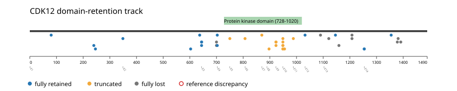
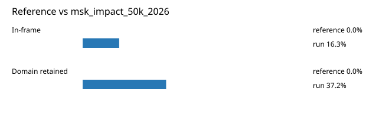

# CDK12 real-data fusion benchmark: msk_impact_50k_2026

Retrieved from public cBioPortal and Genome Nexus on 2026-09-05.

## Results

- Structural variants returned for CDK12: 101
- Protein-fusion records found: 43
- Protein-fusion records mapped: 41
- Malformed/unmappable fusion records skipped: 2
- In-frame: 7/43 (16.3%)
- PF00069 (728-1020 aa) retained: 16/43 (37.2%)
- In-frame and PF00069-retained: 5/7
- Fisher exact test (one-sided): odds ratio 5.22727, p=0.0677006
- Breakpoint-permutation empirical p-value: 0.316832
- Contingency table `[[retained/in-frame, retained/other], [not-retained/in-frame, not-retained/other]]`: `[[5, 11], [2, 23]]`

### Domain retention and discrepancies

*Domain-retention positions for analyzed fusion events; red outlines mark reference discrepancies.*

### Fusion-transcript schematic

*One row per recurrent partner/breakpoint group, sharing one amino-acid x-axis for CDK12's full protein length; the partner-contributed portion is colored per partner, the retained target-gene portion is colored by domain-retention status, and a red line marks the breakpoint.*

## Method

The cBioPortal `msk_impact_50k_2026_structural_variants` structural-variant profile was queried by the configured Entrez gene ID. Fusion-annotated records were adapted to the production SV schema and normalized; when `site2EffectOnFrame=NA`, frame status was resolved from `Event_Info`, not copied into `FusionEvent.Frame_status`.

CDK12 genomic breakpoints were mapped against the Genome Nexus canonical transcript, and retention was classified against its returned PF00069 coordinates. Counts are event-level with no patient deduplication. The Fisher comparison's `other` column combines out-of-frame and unknown-frame events, as pre-specified by the domain-retention algorithm.

For each fusion, breakpoint selection preferred the Genome Nexus canonical transcript's exon-spanned target locus over cBioPortal site labels; malformed rows with no unambiguous target-locus coordinate were skipped and listed in Warnings.

## Full-suite highlights

- Registered algorithms executed: composite_score, confidence_stats, cutpoint_detection, domain_disruption, domain_retention, exon_retention, frequency, joint_partner
- Cutpoint detection: inferred breakpoint 644 aa; corrected permutation p=0.00990099.
- Top composite score: ADCY9 (2 events), 0.275685.

## Partners

ADCY9 (2), AKAP8L (1), ANKFN1 (1), CACNA1G (1), COLEC12 (1), CSF3 (1), ERBB2 (3), FAM222B (1), FBXL20 (6), FGFR4 (1), GRB7 (1), HTR1E (2), IGFBP4 (1), IKZF3 (2), MAP3K3 (2), MED13 (1), MTRES1 (1), ODAD4 (1), RECQL4 (1), RPS6KB1 (1), SEC31A (1), SKAP1 (1), SNF8 (1), SPON1 (1), STAT5B (4), SYNRG (1), TBKBP1 (1), USP6 (1), VMP1 (1)

## Warnings

- Skipped EVT-P-0034157-T02-IM6-60 (CDK12-MAP3K3): ValueError: could not determine 5'/3' role for CDK12 in EVT-P-0034157-T02-IM6-60; Event_Info='Antisense Fusion'
- Skipped EVT-P-0034157-T01-IM6-61 (CDK12-MAP3K3): ValueError: could not determine 5'/3' role for CDK12 in EVT-P-0034157-T01-IM6-61; Event_Info='Antisense Fusion'

## Reference comparison

*Configured reference percentages compared with this run.*

## Interpretation

These values describe the live study named above.
