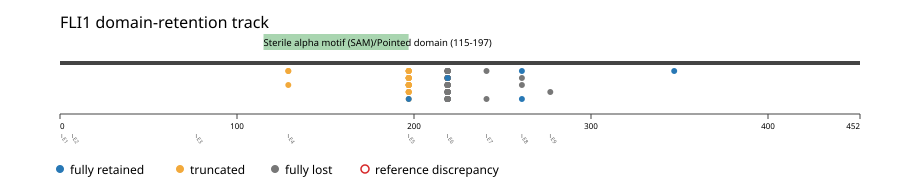
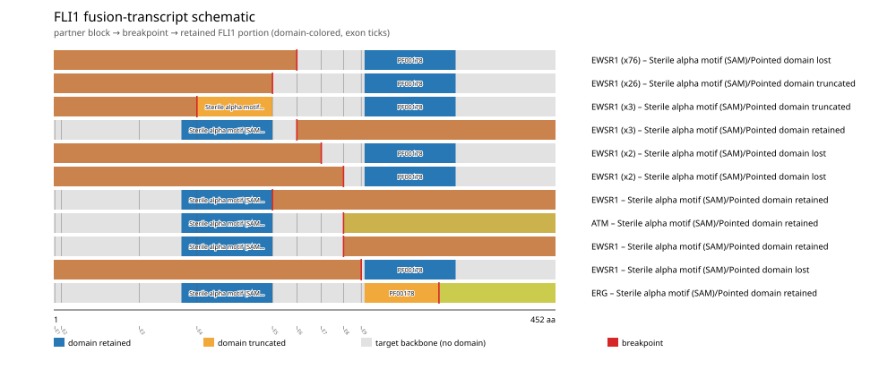
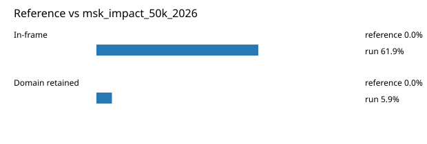

# FLI1 real-data fusion benchmark: msk_impact_50k_2026

Retrieved from public cBioPortal and Genome Nexus on 2026-09-05.

## Results

- Structural variants returned for FLI1: 121
- Protein-fusion records found: 118
- Protein-fusion records mapped: 117
- Malformed/unmappable fusion records skipped: 1
- In-frame: 73/118 (61.9%)
- PF02198 (115-197 aa) retained: 7/118 (5.9%)
- In-frame and PF02198-retained: 2/73
- Fisher exact test (one-sided): odds ratio 0.219718, p=0.988837
- Breakpoint-permutation empirical p-value: 0.80198
- Contingency table `[[retained/in-frame, retained/other], [not-retained/in-frame, not-retained/other]]`: `[[2, 5], [71, 39]]`

### Domain retention and discrepancies

*Domain-retention positions for analyzed fusion events; red outlines mark reference discrepancies.*

### Fusion-transcript schematic

*One row per recurrent partner/breakpoint group, sharing one amino-acid x-axis for FLI1's full protein length; the partner-contributed portion is colored per partner, the retained target-gene portion is colored by domain-retention status, and a red line marks the breakpoint.*

## Method

The cBioPortal `msk_impact_50k_2026_structural_variants` structural-variant profile was queried by the configured Entrez gene ID. Fusion-annotated records were adapted to the production SV schema and normalized; when `site2EffectOnFrame=NA`, frame status was resolved from `Event_Info`, not copied into `FusionEvent.Frame_status`.

FLI1 genomic breakpoints were mapped against the Genome Nexus canonical transcript, and retention was classified against its returned PF02198 coordinates. Counts are event-level with no patient deduplication. The Fisher comparison's `other` column combines out-of-frame and unknown-frame events, as pre-specified by the domain-retention algorithm.

For each fusion, breakpoint selection preferred the Genome Nexus canonical transcript's exon-spanned target locus over cBioPortal site labels; malformed rows with no unambiguous target-locus coordinate were skipped and listed in Warnings.

## Full-suite highlights

- Registered algorithms executed: composite_score, confidence_stats, cutpoint_detection, domain_disruption, domain_retention, exon_retention, frequency, joint_partner
- Cutpoint detection: inferred breakpoint 241 aa; corrected permutation p=0.019802.
- Top composite score: EWSR1 (116 events), 0.58077.

## Partners

ATM (1), ERG (1), EWSR1 (116)

## Warnings

- Skipped EVT-P-0008749-T01-IM5-24 (EWSR1-FLI1): ValueError: could not determine 5'/3' role for FLI1 in EVT-P-0008749-T01-IM5-24; Event_Info='Antisense fusion'

## Reference comparison

*Configured reference percentages compared with this run.*

## Interpretation

These values describe the live study named above.
