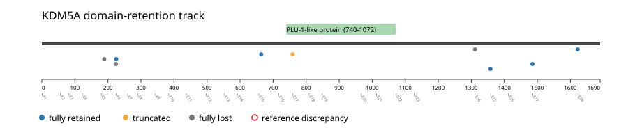
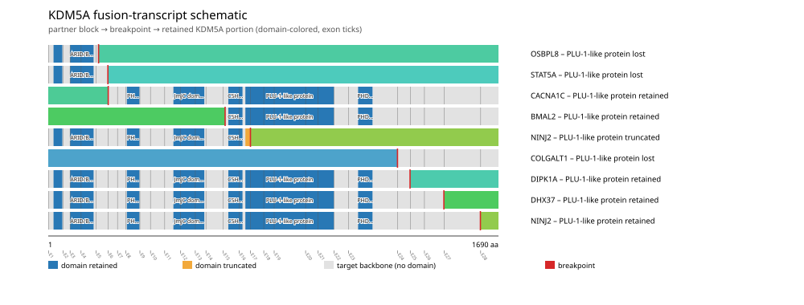
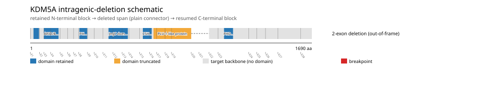
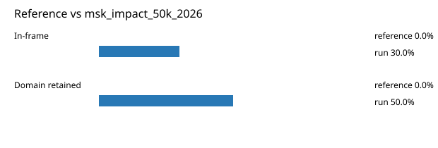

# KDM5A real-data fusion benchmark: msk_impact_50k_2026

Retrieved from public cBioPortal and Genome Nexus on 2026-09-05.

## Results

- Structural variants returned for KDM5A: 45
- Protein-fusion records found: 10
- Protein-fusion records mapped: 9
- Malformed/unmappable fusion records skipped: 1
- In-frame: 3/10 (30.0%)
- PF08429 (740-1072 aa) retained: 5/10 (50.0%)
- In-frame and PF08429-retained: 3/3
- Fisher exact test (one-sided): odds ratio unavailable, p=0.119048
- Breakpoint-permutation empirical p-value: 0.237624
- Contingency table `[[retained/in-frame, retained/other], [not-retained/in-frame, not-retained/other]]`: `[[3, 2], [0, 4]]`

### Domain retention and discrepancies

*Domain-retention positions for analyzed fusion events; red outlines mark reference discrepancies.*

### Fusion-transcript schematic

*One row per recurrent partner/breakpoint group, sharing one amino-acid x-axis for KDM5A's full protein length; the partner-contributed portion is colored per partner, the retained target-gene portion is colored by domain-retention status, and a red line marks the breakpoint.*

### Intragenic-deletion schematic

*Same-gene (Site1==Site2==KDM5A) intragenic-deletion-style SV records: a retained N-terminal block, a plain connector line for the deleted span, and a resumed C-terminal block.*

## Method

The cBioPortal `msk_impact_50k_2026_structural_variants` structural-variant profile was queried by the configured Entrez gene ID. Fusion-annotated records were adapted to the production SV schema and normalized; when `site2EffectOnFrame=NA`, frame status was resolved from `Event_Info`, not copied into `FusionEvent.Frame_status`.

KDM5A genomic breakpoints were mapped against the Genome Nexus canonical transcript, and retention was classified against its returned PF08429 coordinates. Counts are event-level with no patient deduplication. The Fisher comparison's `other` column combines out-of-frame and unknown-frame events, as pre-specified by the domain-retention algorithm.

For each fusion, breakpoint selection preferred the Genome Nexus canonical transcript's exon-spanned target locus over cBioPortal site labels; malformed rows with no unambiguous target-locus coordinate were skipped and listed in Warnings.

## Full-suite highlights

- Registered algorithms executed: composite_score, confidence_stats, cutpoint_detection, domain_disruption, domain_retention, exon_retention, frequency, joint_partner
- Cutpoint detection: inferred breakpoint 1311 aa; corrected permutation p=0.267327.
- Top composite score: COLGALT1 (1 events), 0.233218.

## Partners

BMAL2 (1), CACNA1C (1), COLGALT1 (1), DHX37 (1), DIPK1A (1), NINJ2 (2), OSBPL8 (1), STAT5A (1), USHBP1 (1)

## Warnings

- Skipped EVT-P-0022444-T01-IM6-45 (USHBP1-KDM5A): ValueError: could not determine 5'/3' role for KDM5A in EVT-P-0022444-T01-IM6-45; Event_Info='Antisense Fusion'

## Reference comparison

*Configured reference percentages compared with this run.*

## Interpretation

These values describe the live study named above.
