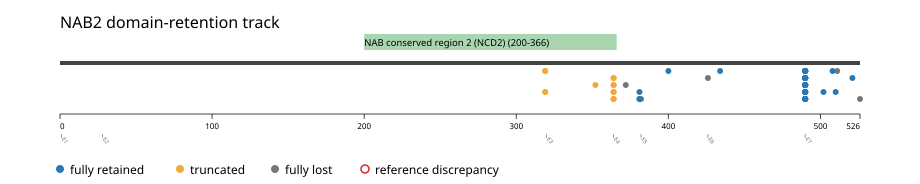
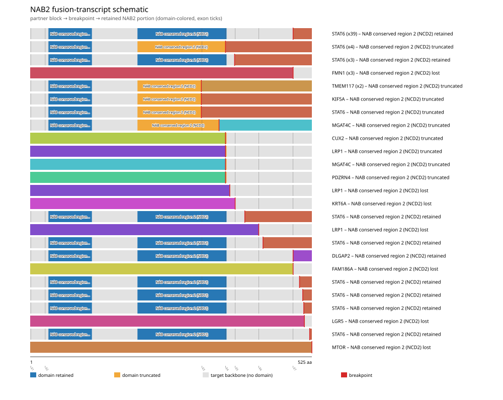
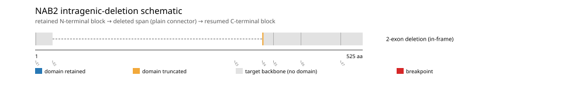
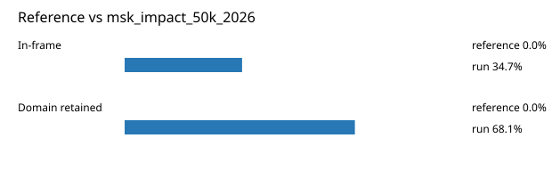

# NAB2 real-data fusion benchmark: msk_impact_50k_2026

Retrieved from public cBioPortal and Genome Nexus on 2026-09-05.

## Results

- Structural variants returned for NAB2: 111
- Protein-fusion records found: 72
- Protein-fusion records mapped: 71
- Malformed/unmappable fusion records skipped: 1
- In-frame: 25/72 (34.7%)
- PF04905 (200-366 aa) retained: 49/72 (68.1%)
- In-frame and PF04905-retained: 20/25
- Fisher exact test (one-sided): odds ratio 2.34483, p=0.11258
- Breakpoint-permutation empirical p-value: 0.00990099
- Contingency table `[[retained/in-frame, retained/other], [not-retained/in-frame, not-retained/other]]`: `[[20, 29], [5, 17]]`

### Domain retention and discrepancies

*Domain-retention positions for analyzed fusion events; red outlines mark reference discrepancies.*

### Fusion-transcript schematic

*One row per recurrent partner/breakpoint group, sharing one amino-acid x-axis for NAB2's full protein length; the partner-contributed portion is colored per partner, the retained target-gene portion is colored by domain-retention status, and a red line marks the breakpoint.*

### Intragenic-deletion schematic

*Same-gene (Site1==Site2==NAB2) intragenic-deletion-style SV records: a retained N-terminal block, a plain connector line for the deleted span, and a resumed C-terminal block.*

## Method

The cBioPortal `msk_impact_50k_2026_structural_variants` structural-variant profile was queried by the configured Entrez gene ID. Fusion-annotated records were adapted to the production SV schema and normalized; when `site2EffectOnFrame=NA`, frame status was resolved from `Event_Info`, not copied into `FusionEvent.Frame_status`.

NAB2 genomic breakpoints were mapped against the Genome Nexus canonical transcript, and retention was classified against its returned PF04905 coordinates. Counts are event-level with no patient deduplication. The Fisher comparison's `other` column combines out-of-frame and unknown-frame events, as pre-specified by the domain-retention algorithm.

For each fusion, breakpoint selection preferred the Genome Nexus canonical transcript's exon-spanned target locus over cBioPortal site labels; malformed rows with no unambiguous target-locus coordinate were skipped and listed in Warnings.

## Full-suite highlights

- Registered algorithms executed: composite_score, confidence_stats, cutpoint_detection, domain_disruption, domain_retention, exon_retention, frequency, joint_partner
- Cutpoint detection: inferred breakpoint 372 aa; corrected permutation p=0.00990099.
- Top composite score: STAT6 (53 events), 0.389134.

## Partners

CUX2 (1), DLGAP2 (1), FAM186A (1), FMN1 (3), KIF5A (1), KRT6A (1), LFNG (1), LGR5 (1), LRP1 (3), MGAT4C (2), MTOR (1), PDZRN4 (1), STAT6 (53), TMEM117 (2)

## Warnings

- Skipped EVT-P-0028319-T01-IM6-15 (NAB2-LFNG): ValueError: could not determine 5'/3' role for NAB2 in EVT-P-0028319-T01-IM6-15; Event_Info='Antisense Fusion'

## Reference comparison

*Configured reference percentages compared with this run.*

## Interpretation

These values describe the live study named above.
